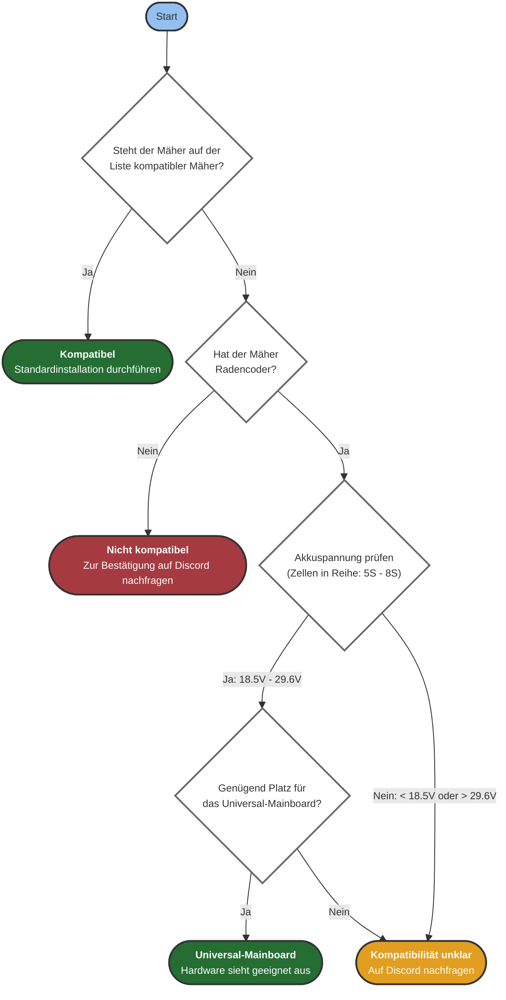

Prüfe vor dem ersten Kauf, ob dein Mäher mit OpenMower kompatibel ist.
Dieses Ablaufdiagramm hilft dir dabei:

{}
Der Spannungsbereich **18,5 V bis 29,6 V** entspricht **5S- bis 8S-Lithium-Akkupacks**, ausgehend von der Nennspannung der Zellen (3,7 V pro Zelle):
- 5S: 5 × 3,7 V = 18,5 V Nennspannung
- 8S: 8 × 3,7 V = 29,6 V Nennspannung

Die Anzahl der in Reihe geschalteten Zellen findest du auf dem Akkuetikett oder in der Anleitung deines Mähers.
{}

## Unterstützte Mähermodelle
Die [Übersicht kompatibler Mäher]({}) listet Modelle von YardForce, SABO und John Deere auf. Sie enthält Fotos der Trägerplatinen und Anforderungen für Umbauten mit dem Universal-Board. Prüfe dein genaues Modell und die Platinenrevision, bevor du weitermachst.
