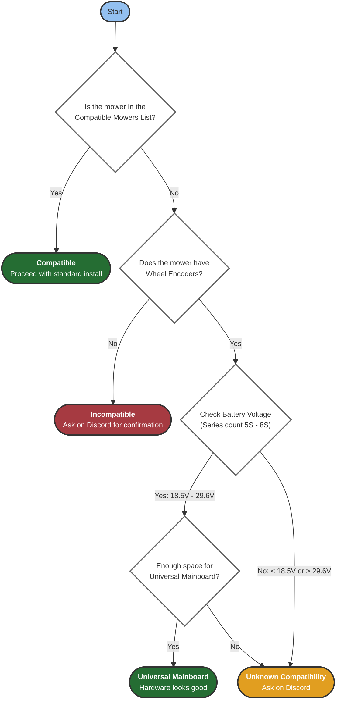
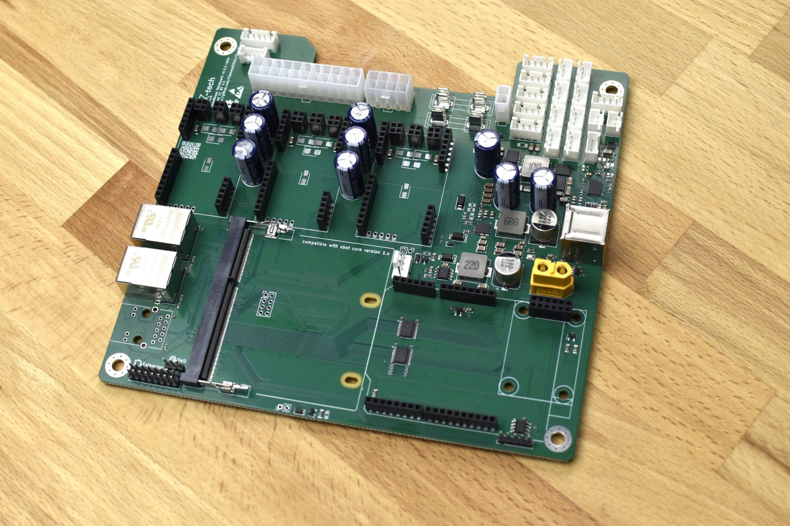
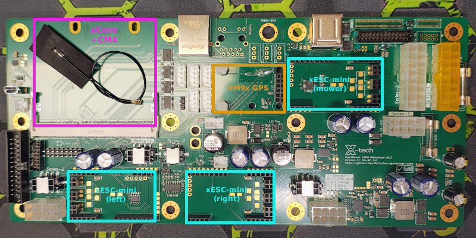
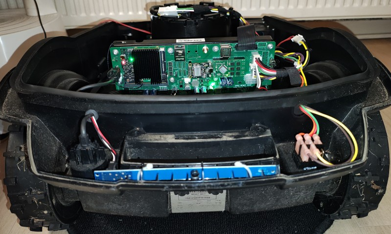

Before purchasing anything, verify your mower is compatible with the OpenMower project.
Use this flowchart to check compatibility:

{}
The voltage range **18.5V - 29.6V** corresponds to **5S-8S lithium battery packs** based on nominal cell voltage (3.7V per cell):
- 5S: 5 × 3.7V = 18.5V nominal
- 8S: 8 × 3.7V = 29.6V nominal

Check your mower's battery label or manual to determine the series count.
{}

# Officially Supported Mowers

## Yard Force

**Check out the Git Repo Here:** [https://github.com/xtech/hw-openmower-yardforce](https://github.com/xtech/hw-openmower-yardforce)

The project got started on a YardForce Classic 500(B), and there are photo guides in this documentation on how to disassemble and reassemble it. From a user's perspective, the YardForce Classic 500(B) is the "best supported" mower. 

**However, there are more mowers from the YardForce brand that are compatible:**

In theory, every YardForce model with the Core + Outer Frame Chassis (SA, SC, LUV, N and NX Line) that has a production year of 2019+ has compatible electronics to replace the stock mainboard with an OpenMower one.

{}
As of today the YardForce Amiro, Compact, EasyMow, MowBest, XPower and MB series models are not (yet) compatible.  
The main reason is that the OpenMower mainboard does not fit in their chassis.
{}

## SABO / John Deere

There is a dedicated mainboard for **SABO MOWit 500F** (Series-I & II) and **John Deere Tango E5** (Series-I & II) mowers.

**Check out the Git Repo Here:** [https://github.com/xtech/hw-openmower-sabo](https://github.com/xtech/hw-openmower-sabo)

This Carrierboard is compatible with the following mower models:

- SABO MOWit 500F (Series-I & II)
- John Deere Tango E5 (Series-I & II)

|                          Series-I Carrierboard (v0.2)                          |                         Series-II Carrierboard (v0.2)                          |
| :----------------------------------------------------------------------------: | :----------------------------------------------------------------------------: |
|   |  |
|                   **Series-I (v0.1) @ John Deere Tango E5**                    |                     **Series-II (v0.1) @ Sabo MOWiT 500F**                     |
|  |      |

These mowers are **well supported**. Even the display controller was replaced by a fully functional, modern user interface!

<video width="640" height="360" controls>
  <source src="sabo-gui.mp4" type="video/mp4">
  Your browser does not support the video tag.
</video>

## Universal Board
The universal board contains all features needed for an Open Mower build (e.g., three BLDC/DC motor controllers, a LiPo charger on board, connectors for GPS, emergency sensors, etc.). It has screw terminals for easy connections and can be broken into smaller modules if it doesn't fit as a whole board.

**Check out the Git Repo Here:** [https://github.com/xtech/hw-openmower-universal](https://github.com/xtech/hw-openmower-universal)

### Other Compatible Brands
The following mower brands are known to have compatible hardware with the Universal mainboard. If you want to check your specific model, ask on Discord. The probability is high that it will work:

- **Husqvarna**: Most Husqvarna mowers
- **Gardena**: Most Gardena mowers  
- **Fuxtec / Redback**: Fuxtec and Redback mowers

### Custom Hardware
If you have a custom chassis, there is a good chance you can get it to work with the Universal board. Ask on Discord for guidance on your specific setup.

