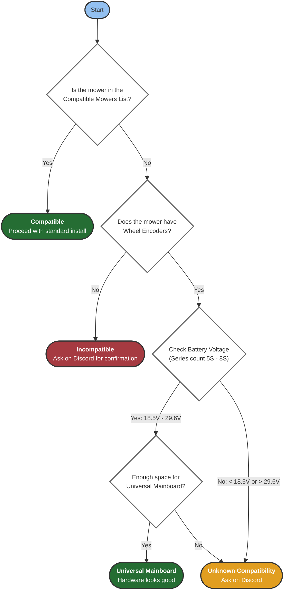

Before purchasing anything, verify your mower is compatible with the OpenMower project.
Use this flowchart to check compatibility:

{}
The voltage range **18.5V - 29.6V** corresponds to **5S-8S lithium battery packs** based on nominal cell voltage (3.7V per cell):
- 5S: 5 × 3.7V = 18.5V nominal
- 8S: 8 × 3.7V = 29.6V nominal

Check your mower's battery label or manual to determine the series count.
{}

# Officially Supported Mowers

