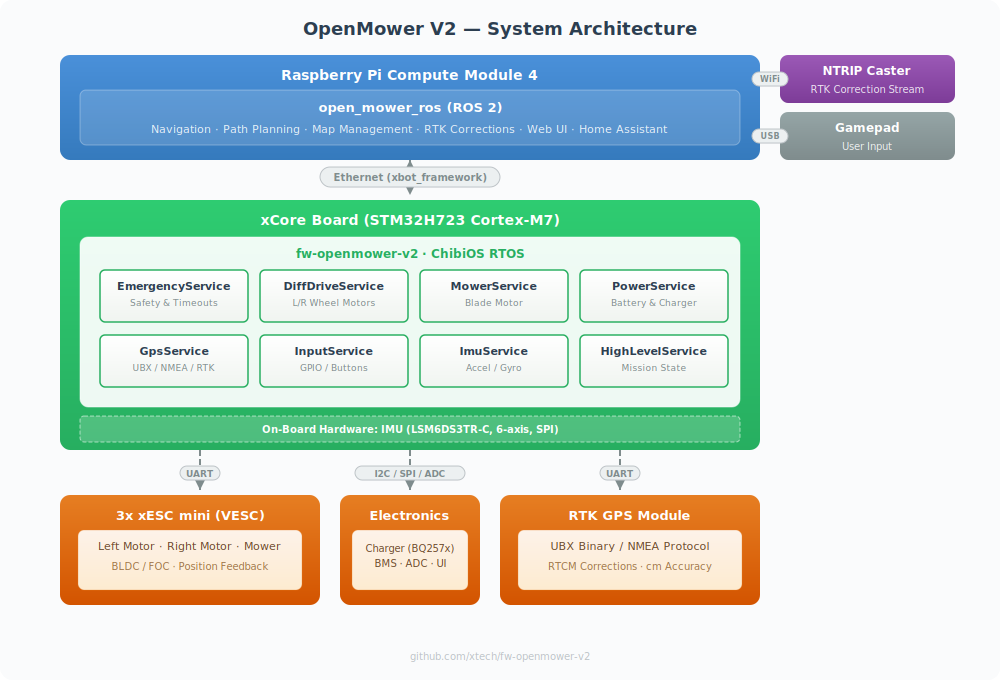

OpenMower is split into distinct layers — each with a clear responsibility — connected by well-defined interfaces. This separation means you can work on navigation logic without touching firmware, or add a new robot platform without changing ROS.

## Layers

### App — User Interface

The OpenMower App runs on a phone or browser and lets the user control the mower, record areas, and monitor status. It communicates with ROS over **MQTT** on the local network via a dedicated ROS node that bridges MQTT messages to ROS topics.

### ROS — Navigation & Planning (Raspberry Pi CM4)

The Raspberry Pi Compute Module 4 runs the full ROS navigation stack. This is where high-level decisions are made: where to drive, how to cover an area, when to dock. ROS receives sensor data (position, orientation, odometry) from the firmware and sends motion commands back.

ROS is deliberately decoupled from hardware — it never talks to motors or sensors directly.

### xbot_framework — The Bridge

ROS and firmware communicate over **Ethernet** using [xbot_framework](https://github.com/xtech/xbot_framework) — a message-passing middleware that decouples the two layers. This means the navigation stack does not need to know anything about the specific hardware platform.

### Firmware — Motor Control & Sensors (xCore · STM32H723)

The firmware runs on the xCore board and owns all low-level hardware: driving the motors via xESC controllers, reading the GPS and IMU, managing the battery and charger, and enforcing safety states (the emergency service can cut power independently of ROS). The same firmware codebase supports multiple robot platforms through compile-time configuration.

### RTK Base Station — Centimetre-Accurate Positioning

RTK GPS works by comparing signals between a rover (the GPS receiver on the mower) and a fixed base station at a known position. The base station sends **RTCM correction data** to the mower's GPS receiver — via radio or over the internet (NTRIP) — reducing positioning error from metres to centimetres. The base station must be external and stationary; this is a fundamental requirement of RTK, not an OpenMower limitation.
