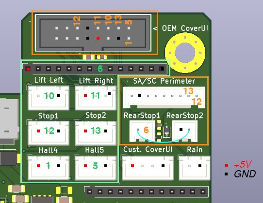

## Overview

OpenMower supports configuring GPIO pins as digital inputs that can trigger emergency stops or other events. Common use cases include:

- **Wheel lift sensors** — detect when the mower is lifted
- **Stop buttons** — physical emergency stop buttons on top of the mower
- **Collision sensors** — detect when the mower hits an obstacle

## Step 1: Create the inputs configuration file

Instead of writing your `inputs.yaml` from scratch, we recommend starting from a ready-made hardware-specific configuration and adjusting it to your wiring. You can find pre-built configs for your Carrierboard at:

[https://github.com/ClemensElflein/open_mower_ros/tree/main/src/open_mower/params/hardware_specific](https://github.com/ClemensElflein/open_mower_ros/tree/main/src/open_mower/params/hardware_specific)

Download the appropriate `inputs.yaml` and place it at `/home/openmower/params/inputs.yaml`.

Here is a minimal example for reference:

```yaml
gpio:
  - name: Front left wheel lift
    line: GPIO10
    active: low
    emergency:
      reason: lift
      delay: 2500

  - name: Front right wheel lift
    line: GPIO11
    active: low
    emergency:
      reason: lift
      delay: 2500

  - name: Top stop button 1
    line: GPIO12
    active: low
    emergency:
      reason: stop
      delay: 10

  - name: Top stop button 2
    line: GPIO13
    active: low
    emergency:
      reason: stop
      delay: 10
```

### Configuration fields

| Field              | Description                                                                                        |
| ------------------ | -------------------------------------------------------------------------------------------------- |
| `name`             | Human-readable label for the input                                                                 |
| `line`             | GPIO pin name (e.g. `GPIO10`)                                                                      |
| `active`           | Logic level that triggers the event — `low` or `high`                                              |
| `emergency.reason` | Emergency type — `lift` for wheel lift, `stop` for stop button, `collision` for obstacle detection |
| `emergency.delay`  | Debounce/delay in milliseconds before the emergency is triggered                                   |

## GPIO Pin Mapping

The example config above uses GPIO10–GPIO13. Here is how those map to physical connectors on each board.



{}
{}

### OpenMower Yardforce Board as of v1.2.0

As of this Yardforce Board version, you may choose between the previous OM JST-XH connectors, which mainly exist for HWv1 upgraders, or the OEM cabling via the CoverUI, which is targeted at new installations.
For this selection to work properly, the board has a Hall-Multiplexer (MUX) which is configured in `inputs.yaml` as follows:
```
yf_cover_ui:
  # ---- Hall Inputs Source Selector ----
  # "om" when the hall sensors get connected to the XHST plugs of the OpenMower board
  #      (or the robot-adapter-pinheader)
  # "oem_idc" when the hall sensors get connected to the (non-modded) OEM CoverUI board
  #      (and CoverUI get connected via the 16pin IDC cable to the OpenMower board)
  - name: Hall Inputs Source Selector
    id: hall_mux
    value: oem_idc
``` 

<br>Depending on how you switch the Hall-MUX, the GPIOs are mapped as shown in this image:

<br>
The green-highlighted plugs/GPIOs are those for Hall-MUX `om`, whereas the orange-highlighted plugs are the ones for Hall-MUX `oem_idc`.

{}
{}

### OpenMower Yardforce Board up to v.1.1.0-beta

Orientation: looking at the board with the ethernet ports at the bottom left, pins sorted top to bottom.

| Position      | GPIO   |
| ------------- | ------ |
| 1st (topmost) | GPIO10 |
| 2nd           | GPIO11 |
| 3rd           | GPIO12 |
| 4th           | GPIO13 |

{}

{}


### OpenMower Universal Board

Orientation: looking at the board with the ethernet ports facing you.

| Position     | GPIO   |
| ------------ | ------ |
| Top left     | GPIO13 |
| Top right    | GPIO12 |
| Bottom right | GPIO11 |
| Bottom left  | GPIO10 |

{}

{}

### OpenMower SABO / John Deere Board

For changes to the default inputs config of the SABO / John Deere Carrierboard, we recommend downloading the [default `inputs.yaml`](https://github.com/ClemensElflein/open_mower_ros/blob/main/src/open_mower/params/hardware_specific/Sabo/inputs.yaml)

{}



## Step 2: Enable the input service

Add the following to your `mower_params.yaml` (or `custom_params.yaml` for Universal board builds):

```yaml
ll:
  services:
    input:
      config_file: /data/params/inputs.yaml
```

To open the file for editing:

```bash
openmower configure ros
```

{}
On OSv2, `/home/openmower/params` is mapped to `/data/params` inside the container. If you are on a different setup, adjust the `config_file` path accordingly.
{}

## Step 3: Restart OpenMower

After saving both files, restart the service to apply the changes:

```bash
openmower restart
```

Your GPIO inputs are now active and will trigger the configured emergency events when the specified logic level is detected.
