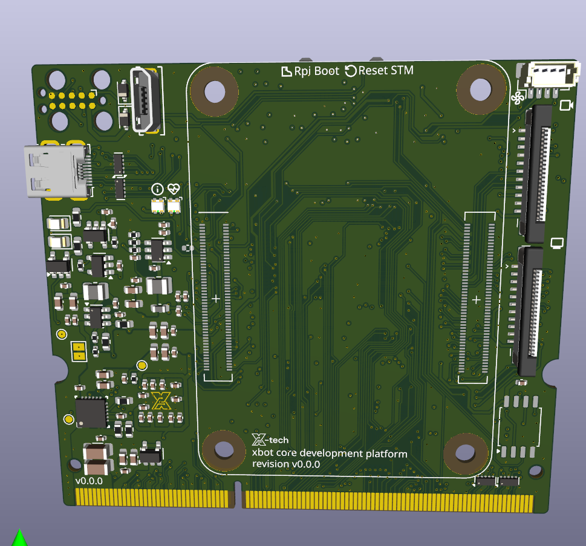

{}
This guide applies **only to CM4 variants with onboard eMMC storage**. The CM4 Lite variant has no eMMC — it uses a microSD card instead and does not require this process.

Check your CM4 model number: variants with eMMC have the storage size in the name (e.g. CM4008032 = 32 GB eMMC). Lite variants are explicitly labelled "Lite" (e.g. CM4008000).
{}

The CM4 with eMMC has onboard flash storage instead of a microSD slot. To flash a new image, you need to put it into USB boot mode so it appears as a mass storage device on your computer.

This guide covers the OpenMower-specific steps. For full reference, see the [official Raspberry Pi documentation](https://www.raspberrypi.com/documentation/computers/compute-module.html#flash-compute-module-emmc).

## Prerequisites

- A host computer (Linux, Windows, or macOS)
- A micro USB cable (connected to the USB port on the xCore board)
- The OS image you want to flash (e.g. OpenMower OS)

## Step 1: Enter USB boot mode

The xCore board has an **Rpi Boot** button (left of the two buttons, label printed below the CM4 slot).



1. Hold the **Rpi Boot** button.
2. While holding it, connect power to the xCore board (or plug in the micro USB cable to your host computer).
3. Release the button once powered.

The CM4 is now in USB boot mode.

## Step 2: Install rpiboot on your host computer



{}
```bash
sudo apt install rpiboot
sudo rpiboot
```
{}

{}
1. Download and run the installer from the [usbboot releases page](https://github.com/raspberrypi/usbboot/releases).
2. Reboot your computer after installation.
3. With the CM4 in USB boot mode, open **Start → rpiboot - Mass Storage Gadget**.
{}

{}
Build rpiboot from source, then run:
```bash
rpiboot -d mass-storage-gadget64
```
See the [usbboot repository](https://github.com/raspberrypi/usbboot) for build instructions.
{}



Within a few seconds the CM4's eMMC will appear as a USB mass storage device on your computer.

{}
If the device is not recognised, avoid USB hubs — connect the micro USB cable directly to your computer.
{}

## Step 3: Flash the image

Use **Raspberry Pi Imager** to write your OS image to the eMMC device. Select the eMMC as the target storage — it will appear like any other USB drive.

Alternatively, use `dd` on Linux/macOS:

```bash
sudo dd if=your-image.img of=/dev/sdX bs=4MiB status=progress oflag=sync
```

Replace `/dev/sdX` with the actual device path of the eMMC. Double-check this before running.

## Step 4: Boot from eMMC

Once flashing is complete, disconnect the micro USB cable and power-cycle the board. The CM4 will boot from the newly flashed image.
