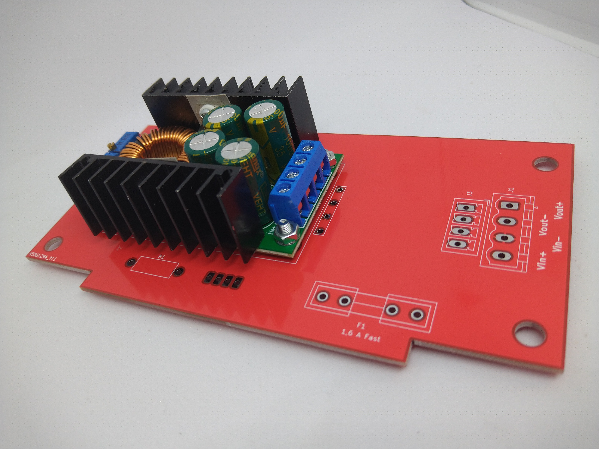
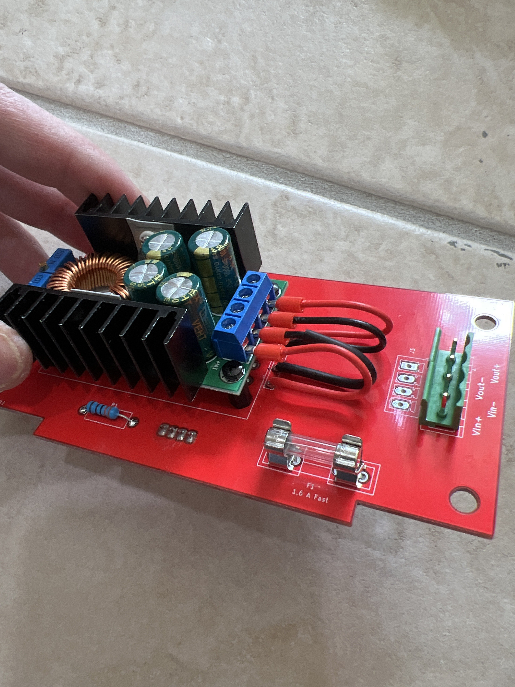
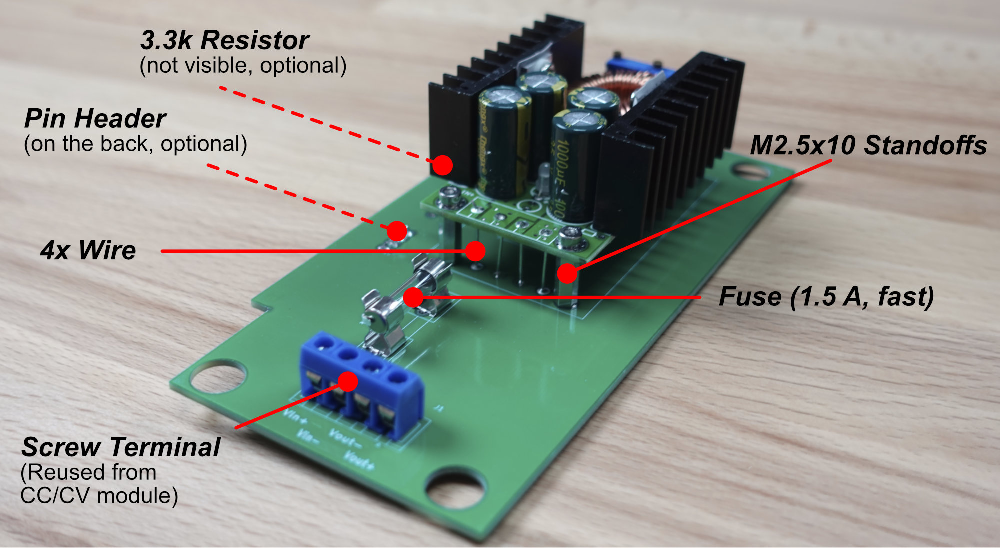
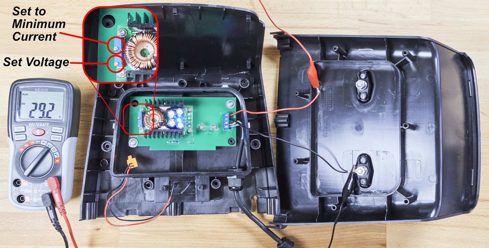
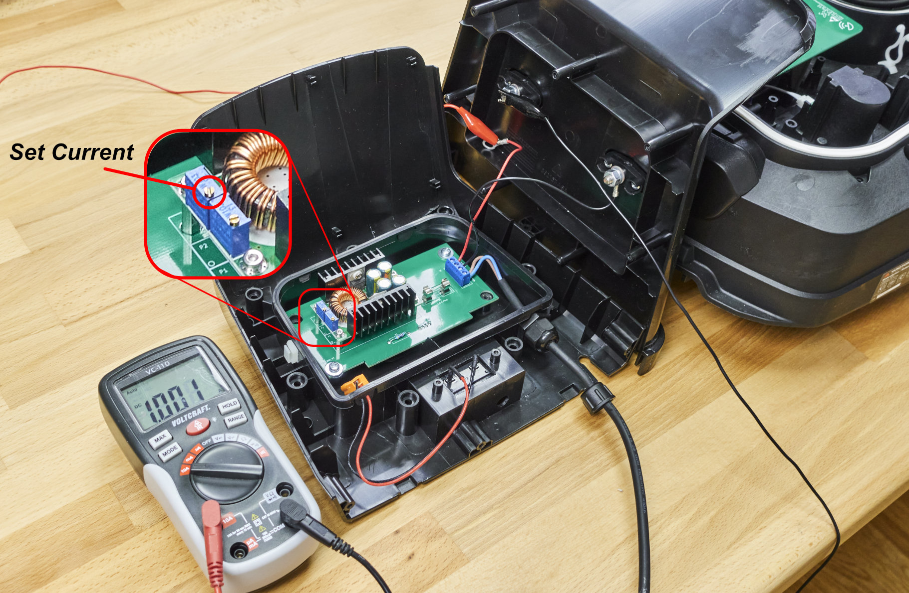

{}
- Don't use the unmodified docking station with the OpenMower mainboard!
- Errors during this step might damage your battery or even cause fires.
- Do not assume the polarity of the original YardForce cable based on colors, use multimeter.
{}

In this section, we modify the docking station. This is needed in order to add a constant current / constant voltage module which will charge the Lipo battery. In order to fit the CC/CV module inside the docking station, I'm using a PCB as carrier board. Additionally, this PCB adds a fuse to protect the module from over-current. 

# Disassemble YF500 docking station
## Step 1: Remove screws on the bottom

First turn the whole docking station upside down.

Remove the 6 screws (red) that hold the docking part. Remove the other 5 screws (yellow) that holds the bottom plate to the docking station.
The docking unit should now come apart from the bottom plate with 2 green wires still attached.

## Step 2: Remove plastic tabs

Go to the back of the docking unit and locate the 2 plastic tabs.

Stick a plastic removal tool/wedge or flathead screwdriver on the bottom of the plastic (see red arrows).

Push down till you hear a click, you should now be able to remove the top plastic part.

## Step 3: Remove orange plastic on top of the docking station

Using your fingers, you can easily remove the orange plastic, just press down, and it should come off.

## Step 4: Remove the back side

Remove the 7 screws (red) on the back of the docking unit.

You should now be able to pull apart the docking station.

# Docking station assembly

## Step 1: Prepare CC/CV module

{}
{}
Skip this step.
{}
{}
## Desolder the original CC/CV module

The first step is to desolder the screw terminals from the CC/CV module. This way we can mount it onto our carrier PCB. It is important that the through-hole connections don't get damaged during desoldering. Therefore, you should use **much heat and no force** during the desoldering process. Clear the through holes using a solder sucker.
{}


## Step 2: Mount the CC/CV module to the PCB and solder the components

{}
{}
 > Kit doesn't include standoffs for CC/CV; it assumes you are mounting CC/CV directly on PCB using 3mm screws. You can use standoffs if you have them.

Alternative to wires would be soldering CC-CV terminals to the holes below directly. Both options are fine.

1. Mount the CC-CV on the dock pcb with 3mm screws

2. Use wires to connect CC-CV

3. Solder the rest of the components 

4. Alternative assembly by quibble_droid

{}
{}
 > If you do not have standoffs or wires, you can connect the PCB using a standard pin-header. These will be shorter, so you can use nuts as spacers (or no spacers at all, make sure to not screw too tightly in order to keep the silkscreen in tact).

The next step is to populate the fuse, the screw terminal and optionally the pin header on the back of the board and a 3.3k resistor. You will need the resistor and pin header if you want to have the LED on the back of the dock light up if power is available. If you don't care about the LED, you don't need to populate these parts.

Another assembly without the standoffs.

{}


## Step 3: Mount the assembly inside the docking station

Now you can mount the whole assembly inside the docking station. Connect the module as shown in the image above.

{}
Many people mistake the polarity of the wires in terminals. Verify them now with multimeter.
{}

## Step 4: Set Voltage

Connect a multimeter as shown in the picture and connect the power supply. Set the voltage to 29.2V and the current to a minimum by turning it all the way counter-clockwise (this is important for the next step!). You should hear a clicking sound as soon as the limit is reached. If not, turn at least 20 turns.

Note that when you turn the current screw all the way counter-clockwise the voltage will be limited too. After turning it counter-clockwise all the way, make sure you give it a small nudge clockwise so you can still accurately measure the voltage.

**Disconnect the power supply.**

## Step 5: Set Current

{}
- Disconnect the power supply prior to changing the connections.
- We can't set the module current by shorting it with the multimeter, because _some modules_ are not working well in a short circuit condition.
- We are using the robot's battery as a load to set the charging current. That's why it is important that the charging current is set as low as possible.
{}

{}
If you have an electronic load, you can also use that. We are looking for a constant current of 1A.
{}

Connect the multimeter as shown in the image below. You will need to disconnect the positive charging terminal for this. Then connect the power supply again and insert the *turned on* mower into the docking station. It is important that the mower is turned on so that the module can actually charge the battery.

 
Now slowly turn the current potentiometer _clockwise_ until your current is at 1.2A. Now turn it down again to 1.0A. This way we can be sure that the module is actually in current limiting mode. _Most modules show this by lighting a red LED._

{}
If you can't reach 1.2A of charging current, your battery is charged too much. Disconnect the mower again and let it run for an hour to discharge the battery a little more. Then try again.

**Remember to turn the current down before trying again**
{}

Once you have set the current **turn off the mower and disconnect the power supply**.

## Step 6: Assemble the Dock
Now that you have set the voltage and the current, you can reassemble the docking station, and it is ready for use. **Don't forget to connect the positive terminal we disconnected earlier!**

## Step 7: Done 🎉
Continue with [Software Setup](/docs/software-setup/).
