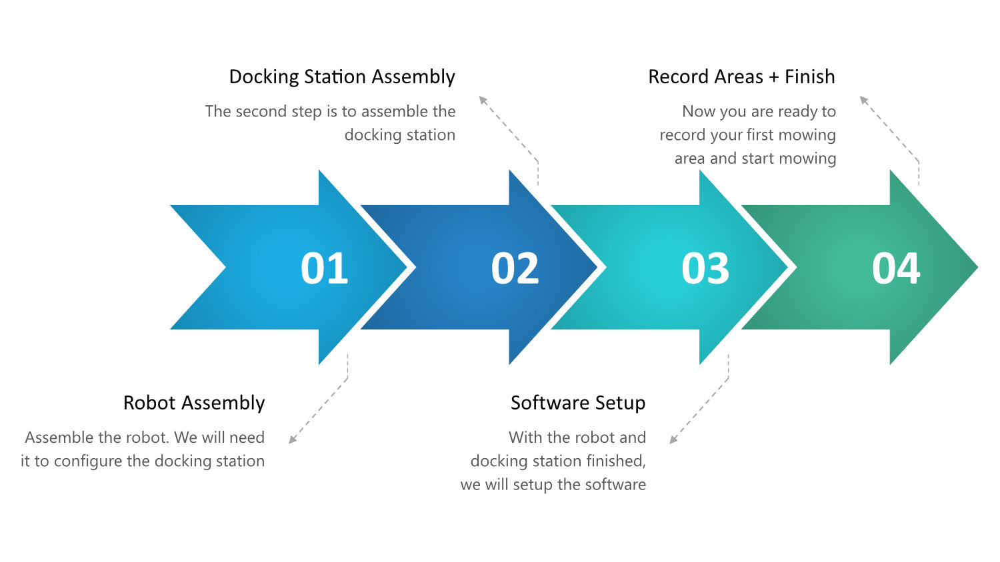

## Important Info

{}
- **Ongoing Development**: The OpenMower project is under continuous development. Be prepared to invest time and effort to get the robot fully operational. While the project is robust, you may encounter bugs or potential issues along the way.
- **DO NOT** use the stock charger with the OpenMower mainboard!
- **Lithium Batteries can be dangerous:** You will be building your own charger. Ensure you are comfortable with this process and understand the associated risks.
- **Read** the entire documentation and **gain a high-level overview**: Understand each step involved in the build before starting.
- **You are responsible for your own actions**: Make sure you know what you're doing!
- **Evolving Documentation**: This documentation is continuously being improved. There may be errors or missing steps. If you have questions, **ask on Discord**.
  {}

## Prerequisites

Read this section thoroughly to understand _which_ components you will need for the Open Mower project and _why_ you need them. This will prevent unnecessary expenses and ensure you are well-prepared.

### Required Knowledge

- **Linux**: You should be comfortable using a Linux PC and know how to set up a Raspberry Pi. While the Open Mower app is available, you may need to adjust settings and debug issues.
- **Electronics**: You should have experience handling PCBs and soldering. Ensure you understand each step you will perform.

### Required Parts

The Open Mower project involves several key components:
- **The Robot**: A modified lawn-mowing robot. You will use the case and motors from an off-the-shelf robot and replace the electronics with custom components. You can either purchase the custom electronics or solder the parts yourself.
- **RTK GPS**: Precision is achieved with RTK GPS, which uses two receivers: one on the robot and one fixed base station. The base station sends error correction data to the robot, enabling centimeter accuracy. This can be done using Wi-Fi or another long-range radio. Note: Some cloud services offer RTK error corrections, both free and paid.
- **Docking Station**: The robot needs a docking station to recharge. Since the original docking station lacks the necessary charging electronics, you will replace the internal electronics. **Do not use the stock docking station with the modified robot.**

Ready to start? Check out the [Shopping List]({}).

## Compatibility Check

## Build Steps

Follow these steps in order to build your OpenMower:
- First, modify the robot following the [Robot Assembly]({}) steps. Avoid leaving the mower powered on too long, as **you cannot charge it using the unmodified docking station**.
- Next, modify the docking station using the [Docking Station Assembly]({}) guide. **You will then be able to charge the battery with the new docking station.**
- Set up the software. This step connects the robot to your Wi-Fi, downloads the OpenMower software, and involves general configuration. Ensure the docking station assembly is complete before starting this step to avoid battery drain.
- Finally, with the software running, use the Open Mower App to record your mowing and navigation areas, and start mowing.

If you have the parts and are ready to assemble the robot, read the [Robot Assembly]({}) documentation.
