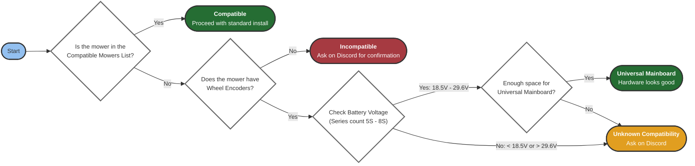

{}

## Quick Facts

- **Build time:** A weekend for a YardForce-class mower; longer for custom chassis
- **Estimated cost:** ~€700 (excluding the mower and RTK base station)
- **Skill level:** Intermediate electronics, Linux, and mechanical skills
- **Community:** 2k+ members on Discord ready to help with reviews and troubleshooting

New to the project? Start with the [Overview page]({}).

## Important Warnings

{}
- **Ongoing Development**: OpenMower is continuously evolving. Be prepared to troubleshoot and update software.
- **Lithium Battery Safety**: You will build your own charger. Understand the risks of working with lithium batteries.
- **Your Responsibility**: Ensure you understand each modification step before proceeding.
- **Read** the entire documentation and **gain a high-level overview**: Understand each step involved in the build before starting.
- **Evolving Documentation**: This documentation is continuously improved. If you find errors or have questions, **ask on Discord**.
  {}

## Is Your Mower Compatible?

Before purchasing anything, verify your mower is compatible with the OpenMower project.
Use this flowchart to check compatibility:

{}
The voltage range **18.5V - 29.6V** corresponds to **5S-8S lithium battery packs** based on nominal cell voltage (3.7V per cell):
- 5S: 5 × 3.7V = 18.5V nominal
- 8S: 8 × 3.7V = 29.6V nominal

Check your mower's battery label or manual to determine the series count.
{}

### Officially Supported Mowers

The following mowers are fully supported with dedicated carrier boards:

- **YardForce Classic 500(B)** - Most common, well-documented
- **Other YardForce Models (SA Series)**
- **SABO MOWit 500F** (Series-I & II)
- **John Deere Tango E5** (Series-I & II)

See the full [Compatible Mowers List]({}) for additional models and community builds.

## What You Need to Know

### Required Skills

- **Linux Basics**: Comfortable with terminal commands, basic file system navigation, and text editing
- **Raspberry Pi Experience**: Ability to set up and configure a Raspberry Pi
- **Electronics Knowledge**: Experience with PCBs, connectors, and basic electrical safety
- **Mechanical Skills**: Ability to disassemble and reassemble your mower

{}
While the OpenMower app simplifies configuration, you may need to debug issues via SSH or adjust settings manually.
{}

### What Parts You'll Need

The OpenMower project requires these main components:

#### 1. The Robot
A compatible lawn-mowing robot with its case and motors. You'll replace the electronics with OpenMower hardware.

#### 2. OpenMower Hardware v2
Custom electronics consisting of:
- **Core Board**: Universal computing module with Raspberry Pi CM4, STM32 controller, IMU
- **Carrier Board**: Model-specific board (YardForce, SABO/John Deere, or Universal)

{}
OpenMower v2 hardware is now available and recommended for all new builds. v1 hardware is deprecated. See the [v2 Announcement]({}) for details.

**To purchase v2 hardware:** Contact @Apehaenger on Discord.
{}

#### 3. RTK GPS System
RTK GPS enables centimeter-level accuracy by sending error corrections to the robot via Wi-Fi or radio.
Therefore, you will need one or two RTK GPS receivers:
- **Rover (required)**: GPS module mounted on the robot
- **Base Station (optional)**: Fixed GPS module providing correction data OR access to an NTRIP service. Some countries have free RTK services available.

#### **Ready to shop?** Check the detailed [Shopping List]({}).

## Build Overview

Follow these steps in sequence:

# TODO: Fill this section

## Get Support

### Discord Community

Join our active Discord community for:
- Build guidance and troubleshooting
- Hardware availability updates
- Software tips and tricks
- Feature discussions

🔗 [Join OpenMower Discord](https://discord.gg/jE7QNaSxW7)

### Documentation & Resources

- **This Documentation**: Reviewed, official information
- **OpenMower Wiki**: Community-contributed guides and tips
- **YouTube Channel**: Video tutorials and project updates

See the [Links]({}) page for all resources.

## Next Steps

If you have a compatible mower and are ready to start building:

➡️ [Review the Shopping List]({})

➡️ [Check the Conversion Guide]({})