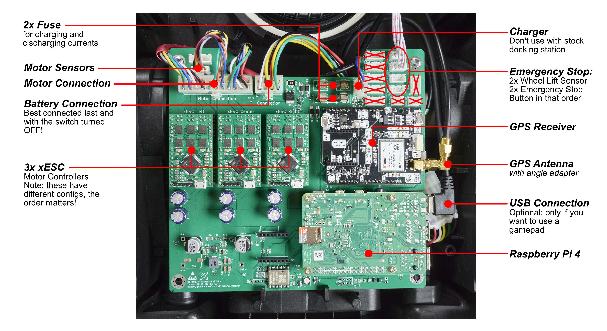

Now that you have prepared the parts, assembling the robot should be easy.

## Step 1: Install the OpenMower mainboard into the robot
Insert the OpenMower mainboard into the robot the same way the original board was mounted. The board is held in place in the rear by two plastic parts, and on the front it is held in place by two screws.

## Step 2: Plug the modules together
After installing the modules, plug the modules into the main board as shown in the following picture:

{}
The three motor controllers have different configurations. Make sure you plug them into the correct slots.
{}

Don't forget to plug the SD card into the Raspberry Pi

## Step 3: Install GPS Antenna

{}
GPS ground plane, GPS 3D printed mount and 15mm bolts with nuts are included in the kits v0.10 and later.

3D part is fragile and can get broken during shipping despite our best efforts. Superglue should fix it.

v0.10: holes on holder are smaller that bolts provided. Widen it with 3mm drill.
{}

In order to improve the reception of the GPS antenna, we put a ground plane below it. This can be any metal plate, but we are using a PCB with a solid copper layer for this.

First put the GPS antenna's cable through the large hole of the PCB and then screw the antenna with the ground plane PCB to the 3D-printed holder. Roll the rest of the antenna cable up so that it's easy to stow inside the robot. 

Once the antenna is fixed to the holder, you can plug it into the front of your robot (you will need to remove two white plastic cable holders) and fixate it using a screw.

## Step 4: Connect Cables
{}
Either make sure that the power connector gets connected last and that the switch is turned off before connecting it.
{}

{}
Don't close the lid of the mower yet. Do the software setup and the first tests without the top cover. You'll probably need to access the hardware again.
{}

Now that you have installed all your electronics, it's time to connect everything up like shown in the picture below:

