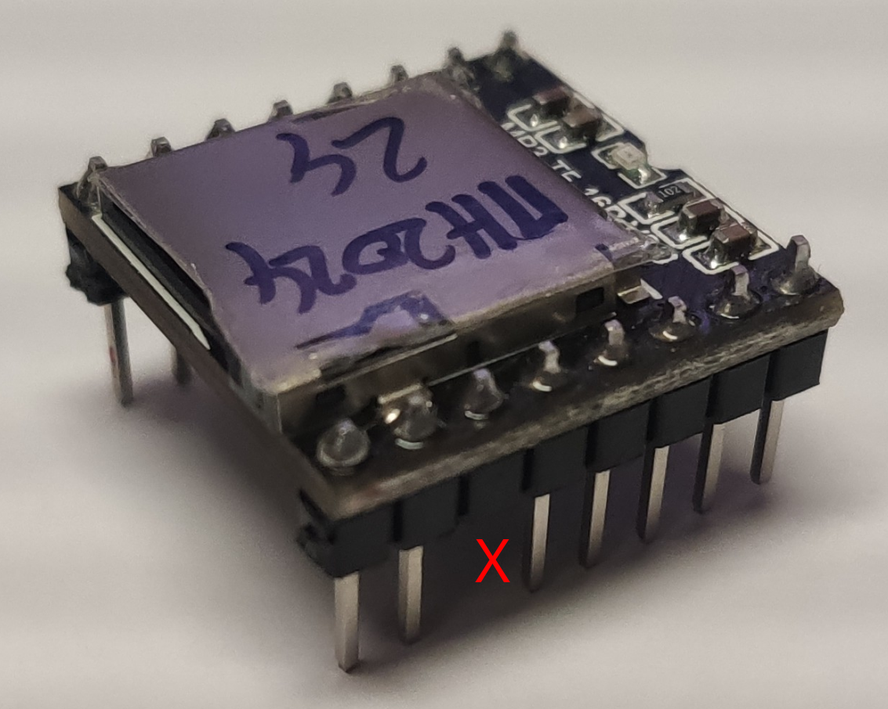
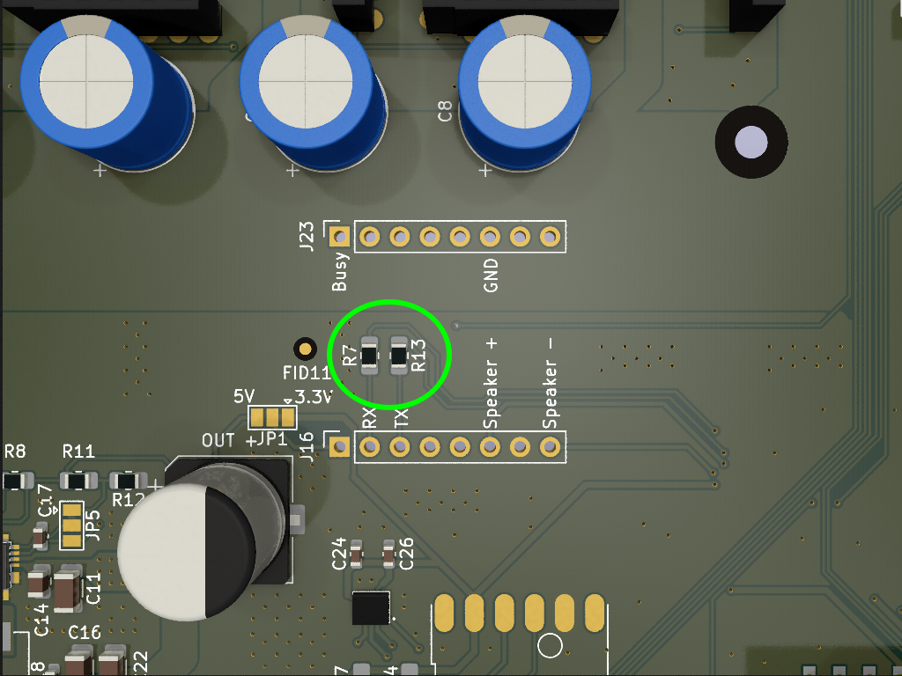
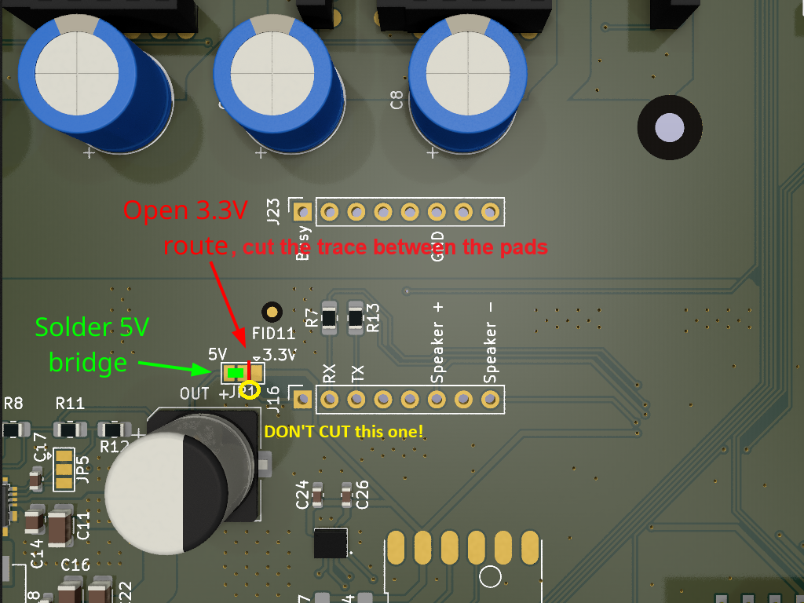

### DFPlayer Module

If your mainboard got delivered with an already equipped DFPlayer, you most likely got the original [DFRobot-DFPlayer](https://www.dfrobot.com/product-1121.html) with a 'DFRobot LISP3' chip.

If you need to attach one, and your're not located in the US, you might also use a DFPlayer-Clone with a 'MH2024K-24SS', 'JL AB23A799755' or 'GD3200B' chip, as sold by Amazon, AliExpress or the like.

{}
When using a DFPlayer-<b>Clone</b>, 
in an open-mower-mainboard up to version 0.13.x, 
you should cut-off Pin-11 from the DFPlayer-Clone: 
 
If not, volume control will not work and always play at 100%!
{}

{}
You also need to take attention that your motherboard has the required R7 and R13 (1k) resistors assembled: 

{}

#### Change DFPlayer's VCC to 5V

All mainboard version &le; 0.13.x supply the DFPlayer with 3.3V by default.
But for full sound support, it's highly advised to change this to 5V, otherwise you might risk your Pico's PMIC 💣. More technical details here: [Sound-Readme](https://github.com/ClemensElflein/OpenMower/blob/main/Firmware/LowLevel/README-Sound%2C%20DFPIS5V.md) 

**Don't forget to cut the trace between middle and 3.3v! It's there, even if it's barely visible!** (if you forgot, you'll bridge the 3v3 with 5V resulting in incorrect battery voltage reporting)

Once changed, you're save to enable full sound support via `OM_DFP_IS_5V=True` [mower_config](../prepare-sd-card/#openmowermower_configtxt-on-linux-bootopenmowermower_configtxt) switch.

#### Sound SD-Card

{}
SDCard (128Mb) and DFPlayer Mini are included in the kit.
{}

Take an SD card (different from the one you are using for RPi), format as FAT32, copy all [MP3 files and folder](https://github.com/ClemensElflein/OpenMower/tree/main/Firmware/LowLevel/soundfiles) to the root folder. Insert SD card to DFPlayer. Insert DFPlayer into motherboard SD card facing right (towards RPi)

{}
The soundfile structure completely changed in November 2024.
If you already prepared your SD-Card before, it still works, but for full sound support you need to **replace** all files with the new structure (and take care that no old origin files remain on the SD-Card).
{}

#### Speaker mount

There're a couple of 3D-Printable speaker mounts available for different models. Worth to check [OpenMower @ Printables](https://www.printables.com/search/models?q=tag:openmower%20speaker)
