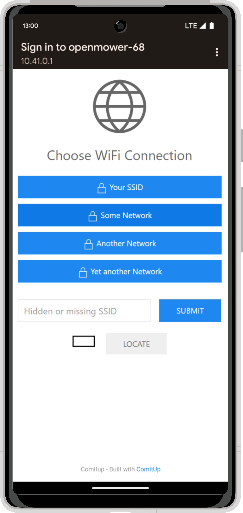

<h2 id=step_0>
  Step 0: Charge the Robot
</h2>

Make sure that the robot is turned on and fully charged, since the software installation will take some time. You can also do this step while the mower is charging in the docking station.

 

<h2 id=step_1>
  Step 1: Search the Hotspot
</h2>

Turn your mower on and wait for the Raspberry Pi to boot. The next step is to connect the Robot to your Wi-Fi network. This way it can download and install the latest OpenMower software.

In order to do this, take any mobile device and search for Wi-Fi networks. Your robot should have opened a hotspot with the credentials you set earlier.

The default credentials are as follows:


{}
{}
**SSID:** openmower-somenumber

**Password:** openmower
{}


Connect to the hotspot and the mobile device should ask you to *sign-in into the network*.

 

{}
  If the mobile device does not automatically open the sign-in page for you, you can access it while being connected with the hotspot by navigating to the following URL in any browser: [`http://10.41.0.1/`](http://10.41.0.1/)
{}

 

<h2 id=step_2>
  Step 2: Enter your Wi-Fi Credentials
</h2>

On the screen, select your home Wi-Fi connection and enter your password. Then click connect. Your robot will connect to your network and the hotspot will disappear. If the connection fails, the hotspot will reopen.

 

<h2 id=step_3>
  Step 3 (Optional): Check Connection
</h2>

Check the connection by using any other PC in your network and `ping openmower.local`. This should be working. Alternatively, you can check if the device is connected by logging into your router.

 

<h2 id=step_4>
  Step 4: Wait
</h2>

If the connection is successful, the Raspberry Pi will download and install the latest OpenMower software automatically.

**This will take some time! Depending on your SD card and your internet connection give it up to 30 minutes!**

You know that the process was successful by looking at the RGB LED on your mainboard. It will either switch to *RED-GREEN blinking* or a *SOLID GREEN*.
