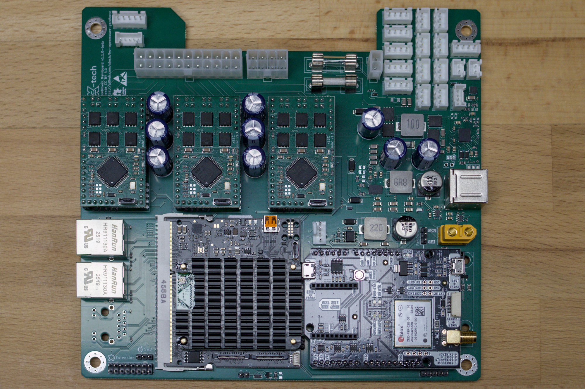

## Prerequisites

In order to follow this guide, you will need:
- **An OpenMower v2 Mainboard**
- **1x xCore Board**
- **1x Raspberry Pi 4 CM4**
- **3x xESC Motor Controllers**
- **1x GPS Module**
- **Mounting Brackets for the xCore**
- **Optional: CM4 Heat Sink**

## Step 2.3.1: Mount the CM4 onto the xCore

### If you are using a CM4 heat sink 
Place the spacer on the lower two mounting holes of the CM4 as shown in the picture. **Do not** place spacers on the upper two holes:

The spacers I used are 1.7 mm thick and were provided with the heat sink.

If you are not using a CM4 heat sink, you can skip this step.

### Mount the CM4 onto the xCore



The next step is to mount the CM4 onto the xCore. To do so:
1. Align the CM4 with the xCore board as shown in the picture. 
2. Place two fingers over the connectors of the xCore and the CM4. 
3. Gently press down until you hear and feel both connectors click.

## Step 2.3.2: Mount CM4 Heat Sink
**__(optional - except for the spacers in the end)__**

{}
This step is different, depending on which heat sink you are using. The images here show the Berry Base heat sink, but the process is similar for other heat sink models as well.

Make sure to use spacers between the PCBs, otherwise the screws will put excessive pressure onto the connectors.
{}



The next step is to mount the heat sink onto the CM4. To do so:
1. Mount the spacers to the heat sink as shown in the picture. 
2. Place all thermal pads onto the corresponding chips. **Important:** The pads have **clear plastic cover on the top** and glue on the bottom. **Do not forget to remove the top plastic cover as well!**
3. Align the heat sink with the CM4 as shown in the picture.
4. Fix the heat sink with the **two screws** on the bottom. **Do not** fix the upper two holes.
5. Press the 3d printed spacer between the CM4 and the xCore board as shown in the picture.
6. It is now a good time to insert the SD card into the CM4 (except for the version with eMMC).

## Step 2.3.3: Insert the xCore into the Mainboard
Now that the xCore board is assembled, it is time to insert it into the mainboard.

{}
Before finishing this step, make sure that your SD card is inserted into the CM4 (if using the version with eMMC, skip this step).
Depending on the mainboard layout, you won't have easy access to the SD card slot later.
{}



Follow these steps to insert the xCore into the mainboard:
1. Insert the xCore board into the slot on the mainboard. It is approximately a 45 degree angle. 
2. Push the board down until it is flat with the mainboard. Make sure the arms on the side engage with the xCore.
3. Use two screws to secure the xCore board to the mainboard. **Don't put spacers or anything, otherwise the mainboard will not fit into the mower (at least for the YardForce Classic 500).**

## Step 2.3.4: Insert xESCs and GPS into the Mainboard
Finally, we can insert the remaining modules into the mainboard.

Match the pins of the xESCs as well as the GPS board to the corresponding pins on the mainboard. Don't worry if some of the ESC pins don't have mating connectors, they are only used for initial firmware upload after the boards are manufactured.

The resulting board will look similar to this (example shows a YardForce mainboard):

## Step 2.3.5: Done :tada:
You have now finished the preparation of the mainboard. You can now proceed with the [mower-specific guide]().