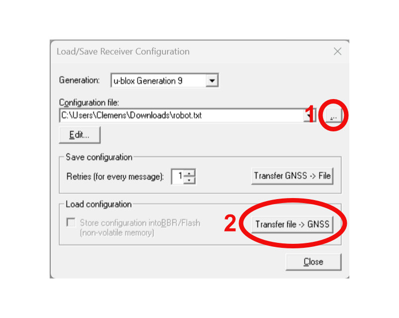
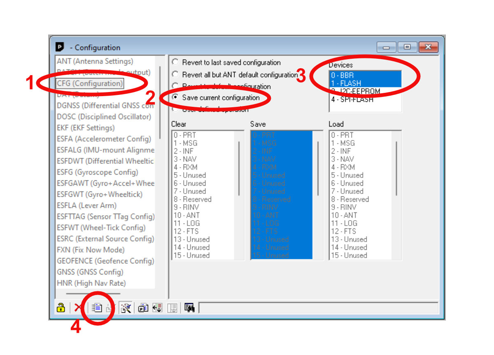
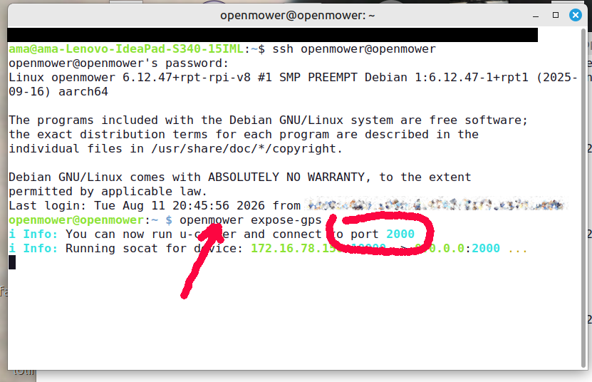
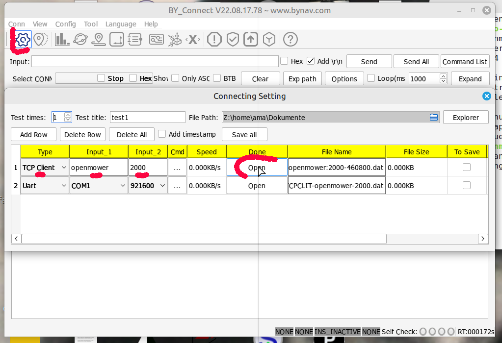
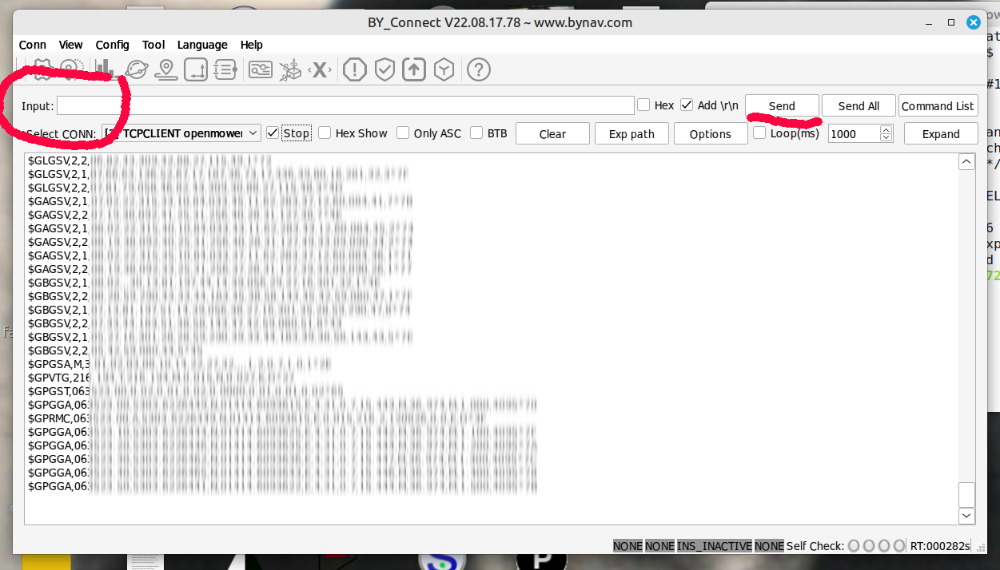
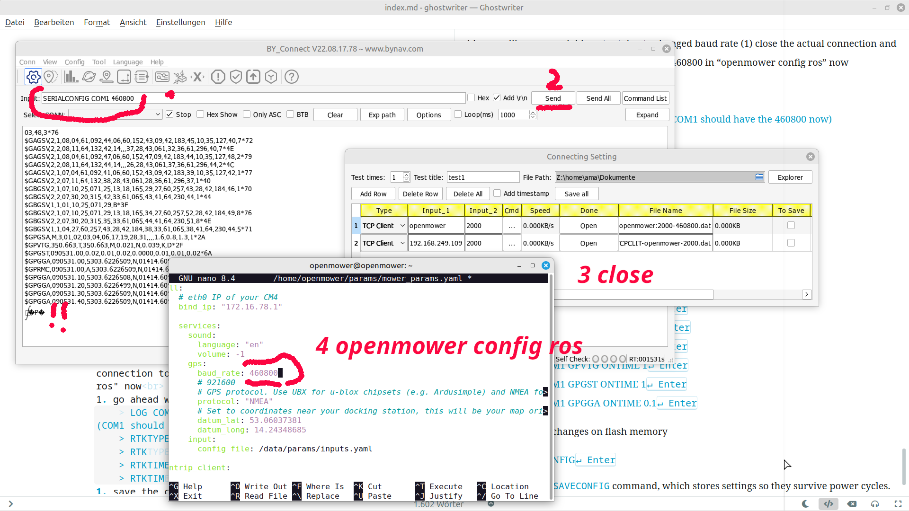


{}
{}


## Update Firmware and configure the GPS board

{}
There is a tutorial video available for this step of the process! <br/>
Check my YouTube video here: [<i class="fa fa-brands fa-youtube"></i> Video](https://youtu.be/_bImqD-pQSA?t=981)
(time 16:21 - 17:15)
{}


### Prerequisites

- **An Ardusimple F9P GPS board**
- **A Micro USB Cable**
- **A Windows PC**
- **Latest v1 version of the u-center software:**<br/>
  🔗&nbsp;[https://www.u-blox.com/en/product/u-center](https://www.u-blox.com/en/product/u-center)<br/>
  Don't get u-center V2, you will need u-center v1 for the F9P.
- **The GPS configuration file**<br/>
  🔗&nbsp;<a href="https://raw.githubusercontent.com/ClemensElflein/OpenMower/refs/heads/main/configs/GPSConfig/robot-fw-1_51.txt" target="_blank">robot-fw-1_51.txt</a><br/>
  This will open in a new browser tab.  Use <kbd>Ctrl</kbd>+<kbd>S</kbd> to download the file.


### Step 2.1.0: Update Firmware

{}
The F9P now exists in multiple variants. The firmware below is for the L1 + L2 version. Make sure that on the u-blox chip, it says one of the following: **ZED-F9P-02B, ZED-F9P-04B or ZED-F9P-05B!**.

If it's a different board, **don't** use the linked firmware, get it from u-blox.com directly.
{}

Update the firmware of your Ardusimple board to version [`ZED-F9P HPG 1.51` - *link here*](https://content.u-blox.com/sites/default/files/2024-11/UBX_F9_100_HPG151_ZED_F9P.6c43b30ccfed539322eccedfb96ad933.bin). There's a guide on the [Ardusimple Website](https://www.ardusimple.com/zed-f9p-firmware-update-with-simplertk2b/).


### Step 2.1.1: Open u-center and connect to your GPS

After installing u-center, connect your Ardusimple board using the "Power+GPS" USB socket to your Windows computer. You should see the blue LEDs of the board come on and Windows should recognize the device as a COM port.
With the module connected to your PC, open the u-center software. 

In u-center, first connect to your board by selecting the appropriate COM port in the `Receiver -> Connection` menu.


### Step 2.1.2: Transfer the configuration to the GPS



After successfully connecting to the board, you can transfer
the previously downloaded configuration file `robot-fw-1_51.txt` by opening the window `Tools -> Receiver Configuration ...`. In this window you open the `robot-fw-1_51.txt` using the `...` button and then transfer the configuration to the GPS by clicking the `Transfer File -> GNSS` button.


### Step 2.1.3: Save configuration to Flash



In order to keep the GPS configured even after powering it down, you need to save the current configuration to Flash memory. In order to do this, select `View -> Configuration View`. In the new window you need to select `CFG (Configuration)` in the list on the left side and then enable `Save current configuration`. Make sure that `0 - BBR` and `1 - FLASH` are both selected on the right side of the window. Once that's done, click the `Send` button in the lower toolbar of the window.

Once successful, there will be a timer showing on the upper right side of the window. This is the timer since the last message was sent to your GPS board. It should be `0s` directly after clicking `Send`.


### Step 2.1.4: Done 🎉

Your GPS is now configured for use with the Open Mower software. You can disconnect it from your Windows PC.

{}


{}

<div class="prep-gps-um9xx-tab">

1. Connect your UM9xx to your PC using the supplied USB-C cable
1. Open a serial terminal (minicom, miniterm, CuteCom, etc.) at 115200 baud
1. Take attention that your line-end termination has to be CR/LF
1. Send `CONFIG`<kbd>↵ Enter</kbd> to verify the connection. You should see readable key/value style output. If not, check cable, port, and permissions.
1. Reset and switch the baud rate to 921600 by entering the following commands, line by line:
   > FRESET<kbd>↵ Enter</kbd><br>
   > CONFIG COM1 921600<kbd>↵ Enter</kbd>

   (After `FRESET` the module may take a few seconds to respond.)
1. Re-check connection with the simple `CONFIG` command. If you don't get similar results than before, change your serial terminal speed to 921600 baud (re-open if necessary) and run `CONFIG` again, till your get a reasonable response
1. Apply the rover configuration by entering the following commands, line by line:
   > MODE ROVER UAV<kbd>↵ Enter</kbd><br>
   > GPGSV COM1 2<kbd>↵ Enter</kbd><br>
   > GPRMC COM1 1<kbd>↵ Enter</kbd><br>
   > GPGSA COM1 1<kbd>↵ Enter</kbd><br>
   > GPVTG COM1 1<kbd>↵ Enter</kbd><br>
   > GPGST COM1 1<kbd>↵ Enter</kbd><br>
   > GPGGA COM1 0.2<kbd>↵ Enter</kbd><br>
   > SAVECONFIG<kbd>↵ Enter</kbd>

   Take attention to the `SAVECONFIG` command, which stores settings so they survive power cycles.
1. Unplug the USB cable from the UM9x module and mount it to the CarrierBoard (solder required headers first if required).

</div>


{}

<div class="prep-gps-um9xx-tab">
  
# Version A 

## use USB cable and usb to serial with cutecom terminal program - standard version

**_For using it with M20 you need to replace each COM1 by COM2_**

1. Connect your M10 to your PC using the supplied USB-C cable
1. Open the recommended terminal program cutecom
2. Connect at 115200 baud
3. You should see readable key/value style output. If not, check cable, port, and permissions.
1. Take attention that your line-end termination has to be CR/LF
2. in cutecom you may switch off the disturbing output, running still but not on screen
3. For Factory Reset and cyclic outputs off - entering the following commands, line by line:
   > FRESET<kbd>↵ Enter</kbd><br> (After `FRESET` the module may take a few seconds to respond.)<br>
   > UNLOGALL<kbd>↵ Enter</kbd>
1. in cutecom you may switch on the output now
1. Re-check connection with the simple
    > LOG VERSION ONCE<kbd>↵ Enter</kbd> command. You should see readable output <br>
1. Apply the rover configuration by entering the following commands, line by line:
    > SERIALCONFIG COM1 460800
1. Re-check connection with the simple
    > LOG VERSION ONCE<kbd>↵ Enter</kbd><br> command. You should see readable output, because we are on Com3 connected. If not check connection and baud rate<br>
1. go ahead with the rover configuration
    > LOG COMCONFIG ONCE<kbd>↵ Enter</kbd>      (COM1 should have the 460800 now) <br>
    > RTKTYPE ROVER<kbd>↵ Enter</kbd><br>
    > RTKTYPE<kbd>↵ Enter</kbd><br>
    > RTKTIMEOUT 5<kbd>↵ Enter</kbd><br>
    > RTKTIMEOUT<kbd>↵ Enter</kbd><br>
1. go ahead to define the cyclic output
    > LOG COM1 GPGSV ONTIME 1<kbd>↵ Enter</kbd><br>
    > LOG COM1 GPRMC ONTIME 1<kbd>↵ Enter</kbd><br>
    > LOG COM1 GPGSA ONTIME 1<kbd>↵ Enter</kbd><br>
    > LOG COM1 GPVTG ONTIME 1<kbd>↵ Enter</kbd><br>
    > LOG COM1 GPGST ONTIME 1<kbd>↵ Enter</kbd><br>
    > LOG COM1 GPGGA ONTIME 0.1<kbd>↵ Enter</kbd><br>
1. finally save the changes on flash memory
    > SAVECONFIG<kbd>↵ Enter</kbd><br>
   Take attention to the `SAVECONFIG` command, which stores settings so they survive power cycles.
1. Unplug the USB cable from the M10 module and mount it to the CarrierBoard (solder required headers first if required).
2. remember to adapt the baud rate in the "openmower config ros"
   > gps:
   >  > baud_rate: 460800 <br>
   >  > protocol: "NMEA"


</div>



{}

<div class="prep-gps-um9xx-tab">
  
# Version B 

## use TCP serial client with by_comm terminal program for online changes

This part is useable for Linux and Windows, where the windows-software by_connect runs under wine in Linux. You need to pstpone this step until your openmower system is running. The configuration will be done remote over TCP
### Prerequisites

* A Witmotion Bynav M10 GPS board original runs at 115200baud
* A openmower full prepared with openmower os
* A Windows or Linux PC
* Latest version of [www.bynav.com "by_connect" software](https://www.bynav.com/media/upload/LargeFile/BY_Connect.zip) <br>
* [www.bynav.com "interface protocol" description as pdf](https://www.bynav.com/media/upload/cms_15/UG017_Interface%20Protocol_Bynav.pdf) This is valid for all By-nav modules like M10, M20 and so on.

**_For using it with M20 you need to replace each COM1 by COM2_**

1. mount the M10 to the CarrierBoard (solder required headers first if required)
2. adapt the baud rate in the "openmower config ros"

```

   gps:
	   baud_rate: 115200 
	   protocol: "NMEA" 
```   	

3. Connect your M10 to TCP-serial by "openmower expose-gps" from your openmower ssh terminal


4. Open the recommended terminal program on your PC "by_connect" (download from www.bynav.com) - for Linux use wine to start this windows program
1. Connect use TCP-Client Openmower 2000, no baudrate needed

3. You should see readable key/value style output. If not, check cable, port, and permissions.
1. Take attention that your line-end termination has to be CR/LF
2. in by_connect you may switch off the disturbing output, running still but not on screen

3. Factory Reset and cyclic outputs off - entering the following commands, line by line:
   > FRESET<kbd>↵ Enter</kbd><br> (After `FRESET` the module may take a few seconds to respond.)<br>
   > UNLOGALL<kbd>↵ Enter</kbd><br>
1. in by_connect you may switch on the output now
1. Re-check connection with the simple
    > LOG VERSION ONCE<kbd>↵ Enter</kbd> command. You should see readable output <br>
1. Apply the rover configuration by entering the following commands, line by line:
    > SERIALCONFIG COM1 460800
1. Re-check connection with the simple
    > LOG VERSION ONCE<kbd>↵ Enter</kbd> command. <br>
1. you will see unreadable output due to changed baud rate (1) close the actual connection and adapt the baud rate of your connection to 460800 in "openmower config ros" now<br> 

openmower expose-gps again, close the PC program "by_connect" reopen it and connect as tcp-client again. Now you see readable content after requesting the following output
   > LOG COMCONFIG ONCE<kbd>↵ Enter
1. go ahead with the rover configuration
    > RTKTYPE ROVER<kbd>↵ Enter</kbd><br>
    > RTKTIMEOUT 5<kbd>↵ Enter</kbd><br>
1. if all worked as expected (answers like ok) then save the changes on flash memory of the M10 Module - else disconnect, power down openmower power up and try again from begin
    > SAVECONFIG<kbd>↵ Enter</kbd><br>
1. go ahead to define the cyclic output
    > LOG COM1 GPGSV ONTIME 1<kbd>↵ Enter</kbd><br>
    > LOG COM1 GPRMC ONTIME 1<kbd>↵ Enter</kbd><br>
    > LOG COM1 GPGSA ONTIME 1<kbd>↵ Enter</kbd><br>
    > LOG COM1 GPVTG ONTIME 1<kbd>↵ Enter</kbd><br>
    > LOG COM1 GPGST ONTIME 1<kbd>↵ Enter</kbd><br>
    > LOG COM1 GPGGA ONTIME 0.1<kbd>↵ Enter</kbd><br>
1. finally save the changes on flash memory
    > SAVECONFIG<kbd>↵ Enter</kbd><br>

Take attention to the `SAVECONFIG` command, which stores settings so they survive power cycles.

</div>





Continue with [Step 2.2: Prepare the SD Card]()
