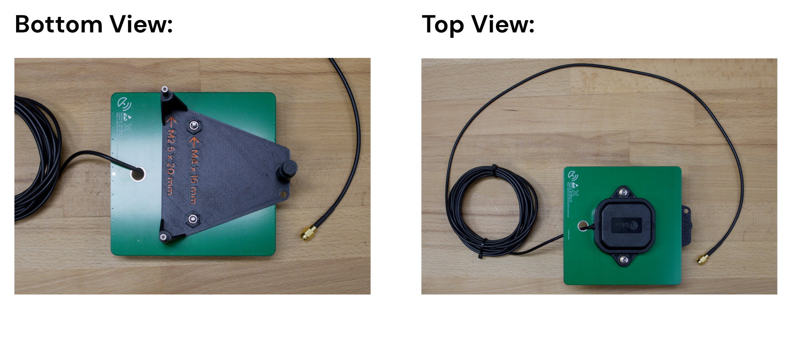
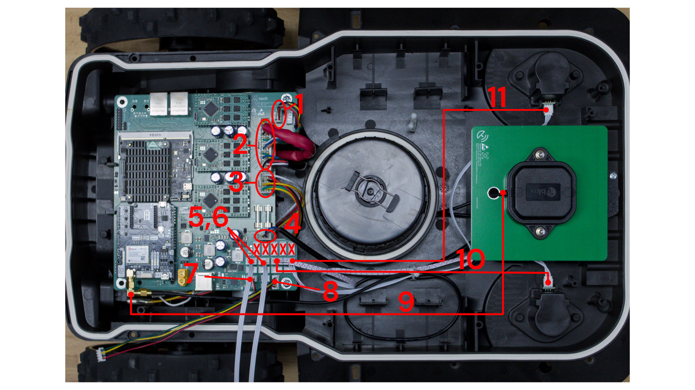

{}
This guide here is for OpenMower v2.x Hardware!
If you have v1 Hardware, follow the legacy docs [here](https://openmower.de/archive/v1.0.2/docs/), because for v1 hardware you will also need to modify the docking station!

You have **v1 hardware**, if:
- You are using a full-size Raspberry Pi
- Your mainboard shows version **v0.xx**
{}

## Prerequisites

### Things you will need:
- **YardForce Classic 500(B)**
- **Open Mower Mainboard** with all modules installed (xCore, CM4, GPS, 3x ESCs)
- **Cover UI Board** (optional)
- **GPS Holder (3d printed part)**, **GPS Antenna**, 2x M2,5x20 screws, 2x M4x16 screws for the GPS holder

### Tools you will need:
- **XH connector set and some wires** to crimp connectors for the emergency stops and the Cover UI board 
- **Some basic screwdrivers** for disassembly and assembly.

## Step 2.4.1: Disassemble the Robot
The first step is to disassemble up the robot.
This is a bit tricky in some parts, so I recommend you checking my YouTube video here: [<i class="fa fa-brands fa-youtube"></i> YouTube Video](https://youtu.be/_bImqD-pQSA?t=148). The relevant time is: 2:25 - 5:08.
**Do not** follow the video further than that, because it is outdated.

Alternatively, here is a picture guide of the disassembly process:

### Unscrew top cover



### Pry the cover

This is a bit tricky in some parts, so I recommend you checking YouTube video
here: [<i class="fa fa-brands fa-youtube"></i> YouTube Video](https://youtu.be/_bImqD-pQSA?t=148). The relevant time is:
2:25 - 5:08.



### Unplug the cover

2 small wires on the front going to wheel sensors, and 1 wide wire from mainboard to cover UI board.
Screwdriver is in the pictures for illustrative purposes, you can simply hold it with your hand.



### Unplug the mainboard



### Remove front PCB



### Remove cover UI board

{}
This section assumes that you are completely replacing the stock UI board with a custom one. There is an option to reuse stock board by flashing it with custom firmware.
If you are going to go this path - leave it in place. You can find more information <a href="https://github.com/ClemensElflein/CoverUI/blob/main/Firmware/CoverUI/YardForce/README.md" target="_blank">in the Cover UI Repo *</a>.

\* Would be nice if someone could transfer this to the Knowledge Base on this website though.
{}



## Step 2.4.2: Remove Stock Electronics

You will need to remove these stock electronics:
- Mainboard
- Perimeter Sensor (slim PCB in the front of the robot).
- All cables in the orange cover (emergency stop).

Keep the battery in place.

## Step 2.4.3: Small Preparations

### 3.1 Cutting Plastic Tabs in the Lid
On some YardForce Classic 500 models, in the lid there are plastic tabs which are in the way when installing the OpenMower mainboard.
We need to clip these tabs off. I have used a large side cutter, but you can also use a Dremel or whatever you have handy.

If your cover does not have tabs, you don't need to do anything here.

### 3.2 Assemble GPS Antenna Holder

Take the GPS antenna holder and assemble it as shown in the picture.

### 3.3 Add new connectors to the Emergency Stop Cables
The Open Mower mainboard uses one JST XH connectors for each of the emergency stop sensors, whereas the original YardForce Classic 500 uses one large connector with all emergency stop buttons connected to it.
In the following picture you can see the original connector cable.

We will now create **four** cables, one for each emergency stop sensor. To do this:
- First, Cut the cable **very close to the large connector** as shown in the picture. You will need the whole length of the emergency stop cables.
- Then, crimp XH connectors to the other end of the cable as shown in the picture below. **Make sure to check the pinout! There is a twist in the connector!**
- **Repeat this step for all four emergency stop sensors**, so that each one has an XH connector at the end. The pinout is the same for all of them.

In the end you will have four cables with **different lengths, but the same pinout**.

### 3.4 Create a cable for the CoverUI
If you are going to use a custom CoverUI board, you will need to create a cable to connect it to the mainboard.
- Take four wires with around 20 cm length.
- Crimp XH connectors on both sides of the cables as shown in the picture. The connections are "straight through", so pin 1 connectos to pin 1 on the other side and so on.

## Step 2.4.4: Install OpenMower Electronics

Now you can install the OpenMower mainboard and the GPS antenna holder we prepared earlier.
- Put the mainboard into the mower just as the original board was installed  (in the rear it sits between plastic tabs, on the front there are two screws holding it in place).
- To fit the GPS holder into the mower, you need need to remove two of the white plastic cable ties by just pulling them upwards. Then plug it into the corresponding holes and fix it with one screw you saved earlier.
- Connect all cables as shown in the picture and the list below.

When finished, it should look like this:

**The connections are as follows:**
1. Mower Motor Sensor
2. Main Motor Connector (Drive motors, mower motors, sensors)
3. Power Connector
4. Charging Contacts
5. Emergency Stop Button in the Lid (left / right side doesn't matter)
6. Emergency Stop Button in the Lid (left / right side doesn't matter)
7. USB Connector on the Rear of the Robot
8. Cover UI Board in the Lid (optional)
9. GPS Antenna
10. Lift Sensor (left / right side doesn't matter)
11. Lift Sensor (left / right side doesn't matter)

## Step 2.4.5: Install external WiFi Antenna (optional)
If you want to use an external WiFi antenna for better reception, installation is simple.

## Prerequisites

### Things you will need:
- **WiFi Antenna Mount:** 3D printed part available on [Printables](https://www.printables.com/model/1504184-openmower-yardforce-classic-500-wifi-antenna-mount)
- **Two Screws** you can use the screws from the front sensor we removed earlier
- **WiFi Antenna with Cable** You can get it from [Amazon](https://amzn.to/48iknlw)

### Steps:
1. Mount the antenna to the holder
2. Mount the holder to the mower using the two screws
3. Connect the antenna to the CM4 board
4. Zip tie the cable to the corner of the PCB

## Step 2.4.6: First Startup

It's time to power the robot up by hitting the switch at the back of the robot.

{}
If you see / smell anything unexpected, turn the switch off **immediately!**

This includes but is not limited to:
- Smoke / Fire
- Smell of hot electronics
- Blown Fuses
  {}

Some battery packs don't like the inrush current and will turn off immediately. If this happens, you can try to turn the switch off and on again and it should work.

Once turned on, LEDs should start blinking on the ESCs, the GPS, the xCore board and the mainboard.
**Keep the robot turned on for at least five minutes to maker sure the CM4 boots up properly. It does setup during the first boot.**

{}
It's a good idea to place the mower into the docking station, so that the battery doesn't drain.

In this state, the battery does not charge, because the core board does not have the correct firmware installed, but the docking voltage will still be used to power the electronics, so the battery will not drain.
{}

If everything seems healthy, proceed to the [Software Setup]().

Otherwise, **stop here and ask for help on the Discord server**.
