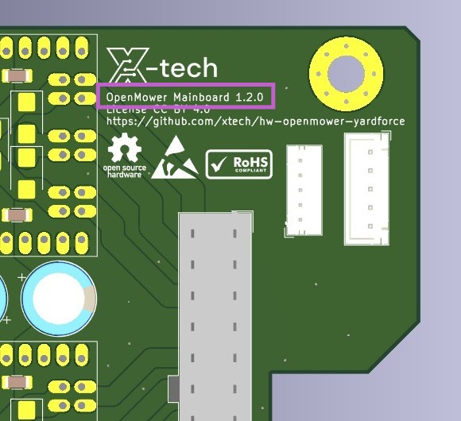
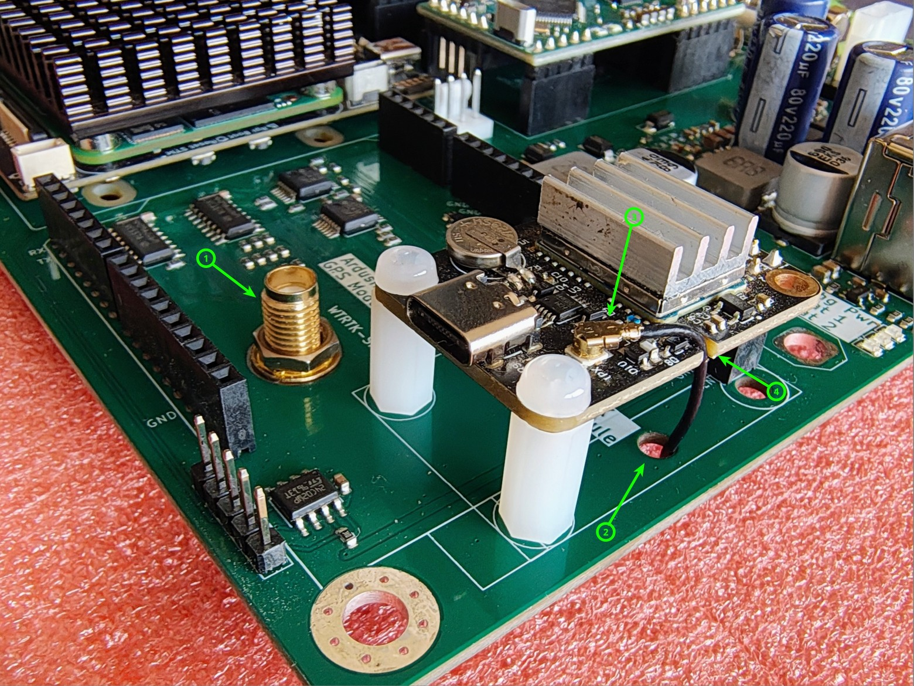
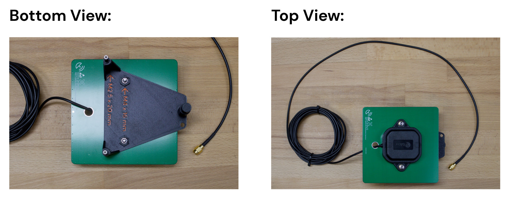
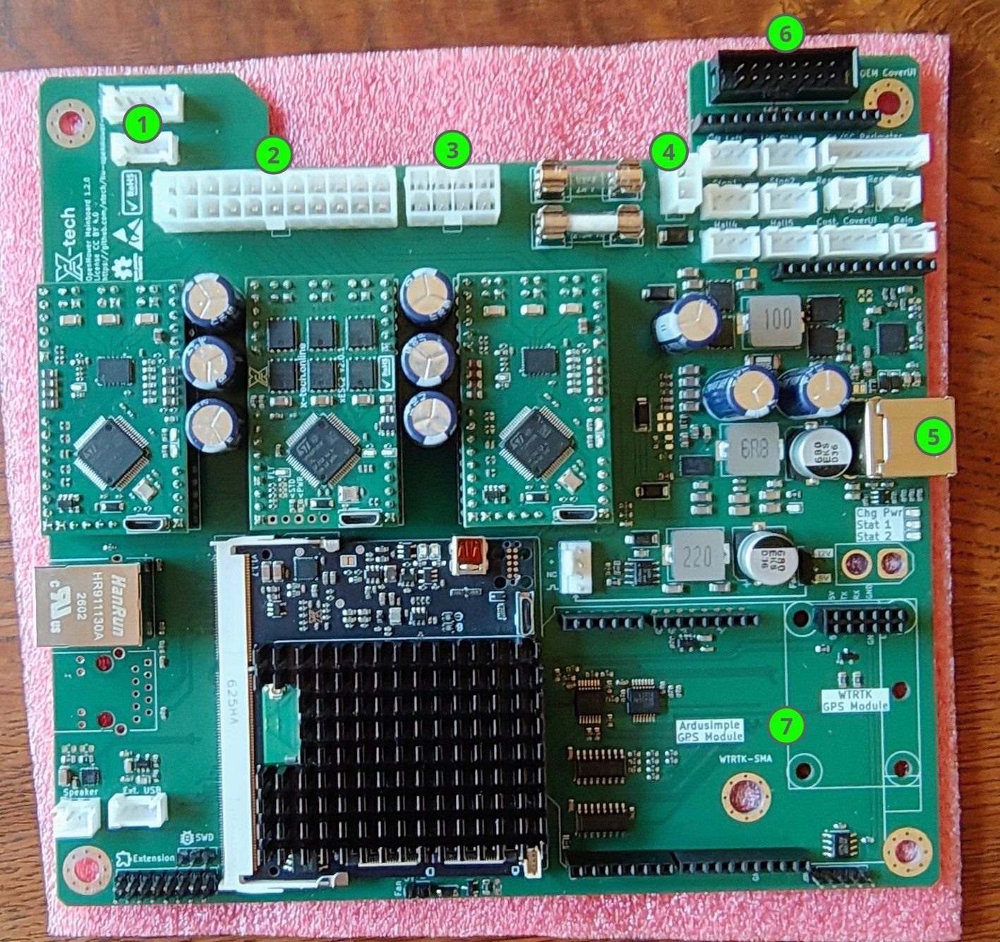
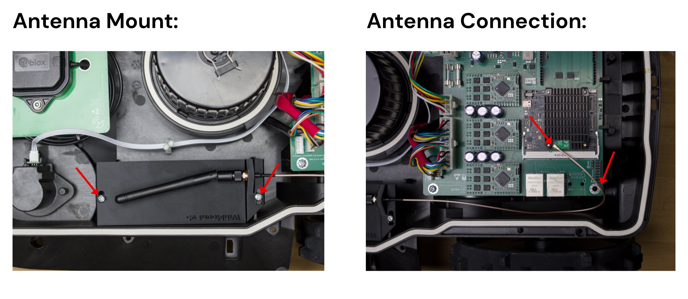

{}
This guide is exclusively for **Carrierboard version ≥ 1.2.0**! 
 
{}

## Prerequisites

### Things you will need:
- **YardForce Classic 500(B)**
- **Open Mower Mainboard** with all modules installed (xCore, CM4, GPS, 3x ESCs)
- **GPS Holder (3d printed part)**, **GPS Antenna**, 2x M2,5x20 screws, 2x M4x16 screws for the GPS holder _(when using Ardusimple RTK2B)_

### Tools you will need:
- **Some basic screwdrivers** for disassembly and assembly.

## Step 2.4.1: Disassemble the Robot
The first step is to disassemble up the robot.
This is a bit tricky in some parts, so I recommend you checking my YouTube video here: [<i class="fa fa-brands fa-youtube"></i> YouTube Video](https://youtu.be/_bImqD-pQSA?t=148). The relevant time is: 2:25 - 5:08.
**Do not** follow the video further than that, because it is outdated.

Alternatively, here is a picture guide of the disassembly process:

### Unscrew top cover



### Pry the cover

This is a bit tricky in some parts, so I recommend you checking YouTube video
here: [<i class="fa fa-brands fa-youtube"></i> YouTube Video](https://youtu.be/_bImqD-pQSA?t=148). The relevant time is:
2:25 - 5:08.



### Unplug the cover

2 small wires on the front going to wheel sensors, and 1 wide wire from mainboard to cover UI board.
Screwdriver is in the pictures for illustrative purposes, you can simply hold it with your hand.



### Unplug the mainboard



### Remove front PCB



## Step 2.4.2: Remove Stock Electronics

You will need to remove these stock electronics:
- Mainboard
- Perimeter Sensor (slim PCB in the front of the robot).

Keep the battery in place.

## Step 2.4.3: Small Preparations


{}

{}

### Assemble Witmotion GPS Module

Install your Witmotion UM9xx or ByNav-Mxx GPS module and the included Witmotion pigtail-cable as shown in the illustration.

{}

{}

### Assemble GPS Antenna Holder

Take the GPS antenna holder and assemble it as shown in the picture.

{}



## Step 2.4.4: Install OpenMower Electronics

Now you can install the OpenMower mainboard and the GPS antenna holder we prepared earlier.
- Put the mainboard into the mower just as the original board was installed  (in the rear it sits between plastic tabs, on the front there are two screws holding it in place).
- To fit the GPS holder into the mower, you need need to remove two of the white plastic cable ties by just pulling them upwards. Then plug it into the corresponding holes and fix it with one screw you saved earlier _(only when using Ardusimple RTK2B)_.
- Connect all cables.

**The connections are as follows:**
1. Mower Motor Sensor
2. Main Motor Connector (Drive motors, mower motors, sensors)
3. Power Connector
4. Charging Contacts
5. USB Connector on the Rear of the Robot
6. OEM CoverUI Board (Emergency sensors, rain sensor, LEDs, buttons)
7. GPS Antenna

## Step 2.4.5: Install external WiFi Antenna (optional)
If you want to use an external WiFi antenna for better reception, installation is simple.

## Prerequisites

### Things you will need:
- **WiFi Antenna Mount:** 3D printed part available on [Printables](https://www.printables.com/model/1504184-openmower-yardforce-classic-500-wifi-antenna-mount)
- **Two Screws** you can use the screws from the front sensor we removed earlier
- **WiFi Antenna with Cable** You can get it from [Amazon](https://amzn.to/48iknlw)

### Steps:
1. Mount the antenna to the holder
2. Mount the holder to the mower using the two screws
3. Connect the antenna to the CM4 board
4. Zip tie the cable to the corner of the PCB

## Step 2.4.6: First Startup

It's time to power the robot up by hitting the switch at the back of the robot.

{}
If you see / smell anything unexpected, turn the switch off **immediately!**

This includes but is not limited to:
- Smoke / Fire
- Smell of hot electronics
- Blown Fuses
  {}

Some battery packs don't like the inrush current and will turn off immediately. If this happens, you can try to turn the switch off and on again and it should work.

Once turned on, LEDs should start blinking on the ESCs, the GPS, the xCore board and the mainboard.
**Keep the robot turned on for at least five minutes to maker sure the CM4 boots up properly. It does setup during the first boot.**

{}
It's a good idea to place the mower into the docking station, so that the battery doesn't drain.

In this state, the battery does not charge, because the core board does not have the correct firmware installed, but the docking voltage will still be used to power the electronics, so the battery will not drain.
{}

If everything seems healthy, proceed to the [Software Setup]().

Otherwise, **stop here and ask for help on the Discord server**.
