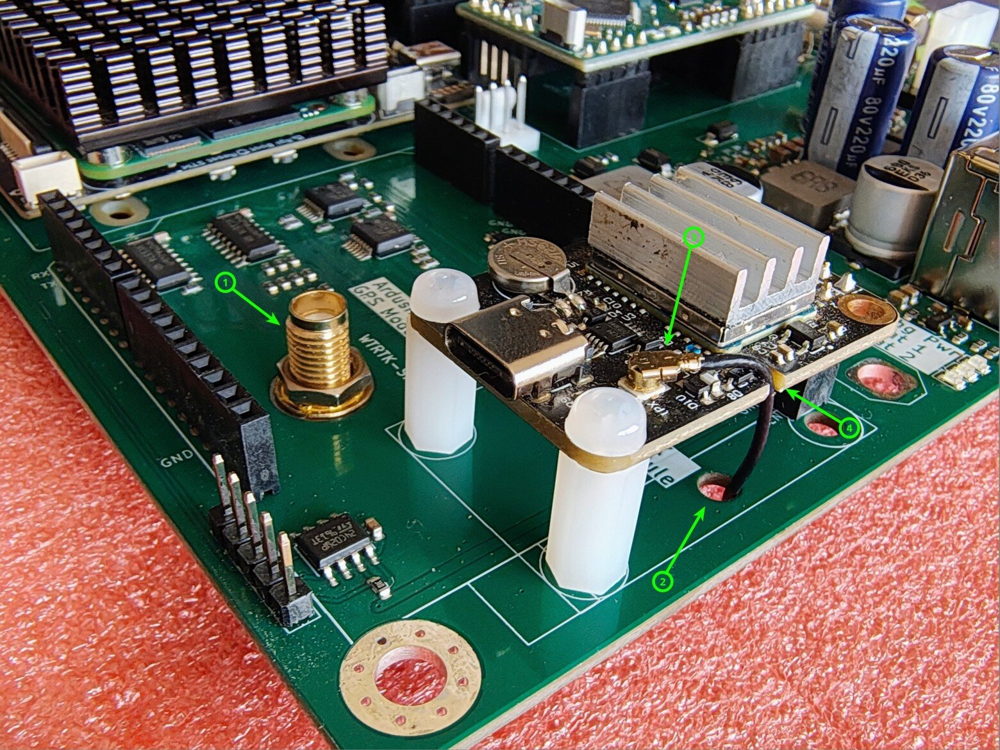
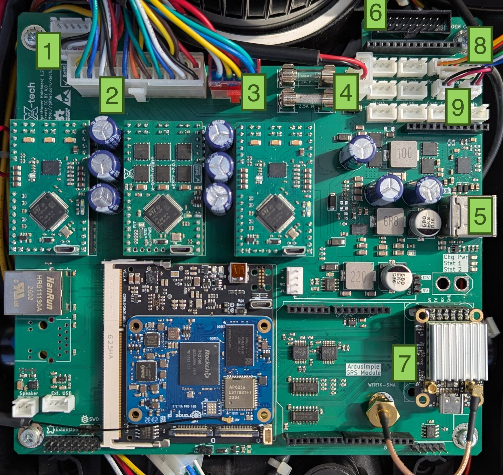

{}
This guide is exclusively for **Carrierboard version ≥ 1.2.0**! 
 
{}

## Prerequisites

### Things you will need:
- **YardForce SA650**
- **Open Mower Mainboard** with all modules installed (xCore, CM4, GPS, 3x ESCs)
- **A way to mount your GPS antenna** (and route your cable, pictures/examples wanted!)
- If you want to use the original speaker, you will need the correct connector and tools.

### Tools you will need:
- **Some basic screwdrivers** for disassembly and assembly.
- **(optional but easy) Cutting pliers** to remove some of the tie wraps around the wires to the mainboard.

## Step 2.4.1: Disassemble the Robot

The first step is to disassemble the robot. Please be careful with the orange "flap".
It is rather fragile and a pain to fix.

### Disconnect perimeter sensor

Close the orange "lid/flap" and place the mower on its back. As the perimeter and lift sensors are connected via 2 wires to the inner part, it is needed
to disconnect them temporarily. Keep the perimeter sensor, it will be connected later.



### Remove outer shell

Remove the 4 large screws, and lift out the main body. Put the cover, perimeter sensor and screws
to the side for now.



### Remove the cover

Place the main body on its wheels and set the mowing height to minimum (20MIN). Pull the adjustment knob straight
up and remove. Remove the 13 screws, and carefully lift and flip the top to the right. Disconnect the ribbon cable
and place the top cover to the side for now.



### Unplug the mainboard

Disconnect all cables from the mainboard and remove the 4 screws (one is hidden in the picture behind the large
connector). It might be easier if you cut some of the tie wraps on the cabling. Remove the main board.



## Step 2.4.2: Small Preparations


{}

{}

### Assemble Witmotion GPS Module

Install your Witmotion UM9xx or ByNav-Mxx GPS module and the included Witmotion pigtail-cable as shown in the illustration.

{}

{}

### Assemble Ardusimple GPS Module

<!-- Raw HTML instead of the alert shortcode: that shortcode indents its body by 4
     spaces, which the enclosing tab re-parses as a code block. -->

<h4 class="alert-heading">Images needed</h4>
We don't have pictures of the mounted Ardusimple yet. If you have mounted one, please share your pictures on 
<a href="https://discord.gg/jE7QNaSxW7">Discord</a> so we can complete this guide.

{}



## Step 2.4.3: Install OpenMower Electronics

Now you can install the OpenMower mainboard and the GPS antenna holder we prepared earlier.
- Put the mainboard into the mower just as the original board was installed.
- Get your GPS antenna and cabling installed/done.
- Connect all cables.

**The connections are as follows:**
1. Mower Motor Sensor
2. Main Motor Connector (Drive motors, mower motors, sensors)
3. Power Connector
4. Charging Contacts
5. USB Connector on the Rear of the Robot (not necessary)
6. OEM CoverUI Board (Emergency sensors, rain sensor, LEDs, buttons)
7. GPS Antenna
8. Perimeter sensor cable (needed for lift sensors and stop button)
9. Rear stop button connectors

## Step 2.4.4: Install external WiFi Antenna (optional)

If you want to use an external WiFi antenna for better reception, please share any pictures if you do.

## Step 2.4.5: First Startup

It's time to power the robot up by hitting the switch at the back of the robot.

{}
If you see / smell anything unexpected, turn the switch off **immediately!**

This includes but is not limited to:
- Smoke / Fire
- Smell of hot electronics
- Blown Fuses
{}

Some battery packs don't like the inrush current and will turn off immediately. If this happens, you can try to turn the switch off and on again and it should work.

Once turned on, LEDs should start blinking on the ESCs, the GPS, the xCore board and the mainboard.
**Keep the robot turned on for at least five minutes to make sure the CM4 boots up properly. It does setup during the first boot.**

{}
It's a good idea to place the mower into the docking station, so that the battery doesn't drain.

In this state, the battery does not charge, because the core board does not have the correct firmware installed, but the docking voltage will still be used to power the electronics, so the battery will not drain.
{}

If everything seems healthy, proceed to the [Software Setup]().

Otherwise, **stop here and ask for help on the Discord server**.
