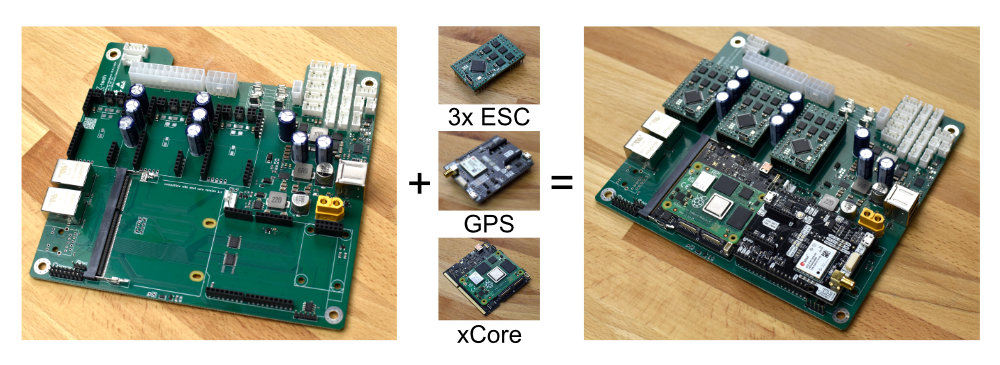
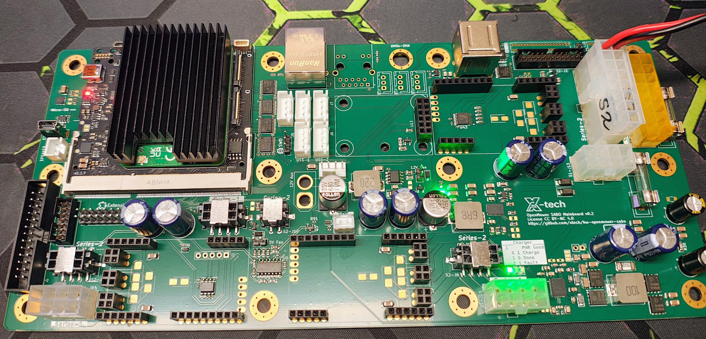
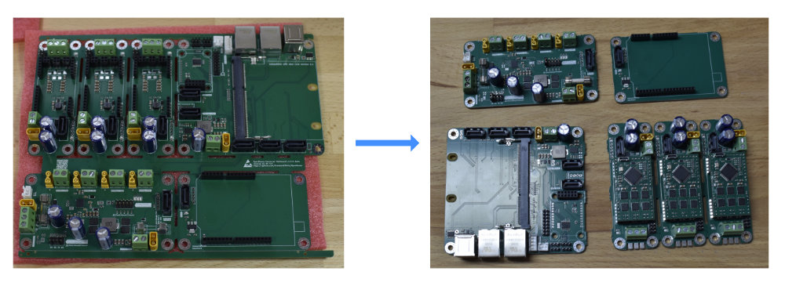

It’s been a while since the last proper OpenMower update—three years, in fact. Back then, the project was barely more than a prototype. No kits, no polished user experience—just some soldered PCBs and command-line interactions.

Fast-forward to today, and OpenMower has matured in a big way.

### **How Far We've Come**

When the project started, users had to build their mowers from scratch, often hand-soldering the entire PCB. Just getting it to mow required diving into terminal commands—not exactly plug-and-play.

But the community stuck with it, and together, we’ve made huge strides:

- ✅ **Pre-built hardware kits** are now available.
- ✅ **Improved documentation** makes getting started far easier.
- ✅ A **ready-to-use OS image** pulls the latest software via Docker. (Shoutout to @DocGalaxyBlock for that!)
- ✅ A **dedicated app** lets you teach mowing areas, start jobs, and monitor progress.
- ✅ The **software is significantly more stable.**
- ✅ There’s even **Home Assistant integration** created by the community!

* * *

### **Introducing OpenMower v2 Hardware**

##### **Why We Need New Hardware**

Despite the progress, OpenMower hardware currently has a major limitation: **it only works with YardForce mowers**. 
Using any other hardware is currently very hard and therefore only done by a few custom builds. That’s not what OpenMower was supposed to be about.

So we set out to fix that—with a **modular, mower-agnostic hardware platform**.

##### **The New Hardware Concept**

For over one year I have completely redesigned the hardware from the ground up to get the OpenMower project on the next level. The new architecture splits the hardware into two parts:

- **A universal core board**
- **Simple, Model-specific carrier boards**

The **core board** is the brains of the operation. It includes:

- Raspberry Pi Compute Module 4 (or alternative modules with similar form factor)
- Powerful STM32 microcontroller (550 MHz)
- Gigabit Ethernet switch
- Onboard IMU
- Flash Storage for Configuration
- SODIMM Connector for easy integration and installation 

This core board stays the same across all mowers.

The **carrier boards**, on the other hand, are tailored to each mower model. They handle:

- Power delivery
- LiPo charging circuit (configuration and monitoring via software)
- Motor drivers
- Physical connectors
- EEPROM (so the core board can auto-detect the actual mower which is currently running the software)
- There is also a I2S sound chip, 12V power supply and an extension port for custom addons

The idea is to keep the carrier boards as simple as possible, so it should be easy to adapt them for a new mower.

#### **YardForce v2 Board**
This is the YardForce v2 Board which is similar in shape to the current v1 board and also has the same connectors.
In addition, it now features a built-in sound chip, more emergency stop connectors, additional ethernet ports, a connector for UM9XX GPS boards, a 12V power supply for user extensions (switchable via software) and
the extension port for custom addons.

#### **SABO / John Deere Board**
The SABO mainboard (great work by @Apehaenger) has all the same features, the YardForce v2 board has and works with the following mower models:
- SABO MOWit 500F (Series-I & II)
- John Deere Tango E5 (Series-I & II)

#### **Universal Board**
The universal board is a bit special. It is designed to work with many robot platforms. Power can be delivered via screw terminal connections or XT30 plugs.
Motor connections can either be soldered directly or can also be done using screw terminals.

As for GPS, you have three different options: The Ardusimple F9P Arduino Board, the Ardusimple micro or the UM9XX GPS.

Now to the special part: If the board doesn't fit your mower, it can be broken apart into modules (see picture). The modules can then be distributed in the mower
and reconnected using power and data cables. Currently we are using SATA for the data connections, but for the next revision, other plugs will be used instead.

### **Firmware: Rewritten from Scratch**

The new firmware is fully open-source (GPL licensed) and runs on ChibiOS, the real-time operating system which also powers the xESC motor controllers. The STM32 microcontroller now has more responsibility, therefore the firmware was completely rewritten from scratch.

Key features include:
- **Single Binary** for all the mowers! The firmware detects the actual mower hardware automatically on power up and configures itself accordingly. 
- STM32 <-> Pi communication over **Ethernet**, improving speed and development flexibility.
- **Failsafe behavior**: Emergency stop and charging circuits work independently of the ROS stack.
- Allows the compute module to be powered down when idle to save energy.

Huge thanks to @rovo89 for help on the firmware side!

### **What’s Available Today**

There are already **three carrier board designs** available:

- ✅ **YardForce** (The reference design, surpassing the current hardware design)
- ✅ **John Deere / SABO** mowers (Big thanks to @Apehaenger!)
- ✅ **Universal Board** compatible with many other models

We’ve also completed a small **beta test round**—with solid results. Some builds have been running for months without issues.

📬 **If you are interested in getting the hardware, DM me (@c.ez) on Discord!**

* * *

### **What’s Next for OpenMower**

We’re not done yet. Here’s what’s coming:

- 🚀 **Migration to ROS2** (ROS1 is EOL)
- 📅 **Visual scheduling system**
- 🧠 **Obstacle avoidance**
- 🛠️ **General usability improvements**

A lot of this is already being explored by the community. It’s exciting to watch new features emerge from real-world use.

### **Get Involved!**
##### **Get v2 Hardware**

It would be great to see people trying and testing the v2 hardware, so I will be making a limited batch available soon!

Do you want to test the v2 hardware or even contribute to development? Do you want to help writing the docs for v2? Or maybe just be among the first people to get their hands on the v2 hardware? 

In any case:
📬 **DM me (@c.ez) on Discord!** 

##### **Support the Project**

Also, if you’d like to support the project financially and help me dedicate more time to OpenMower, check out my [Patreon](https://www.patreon.com/ClemensElflein). Every bit helps, and I truly appreciate the support.

Thanks for reading the whole thing — and see you in the next update!

### **Questions**
#### Will my v1 mower break?
No, the software will be backwards compatible with the current hardware
#### Will the new kit be more expensive than the current one?
The new kit is almost the same price as the current one, even though its more capable
#### Is the new hardware required to run the OpenMower Software?
No, there is a clear-cut interface to the lower communication layer. You can still do custom builds
which use reverse engineered stock hardware (or any other custom hardware)

